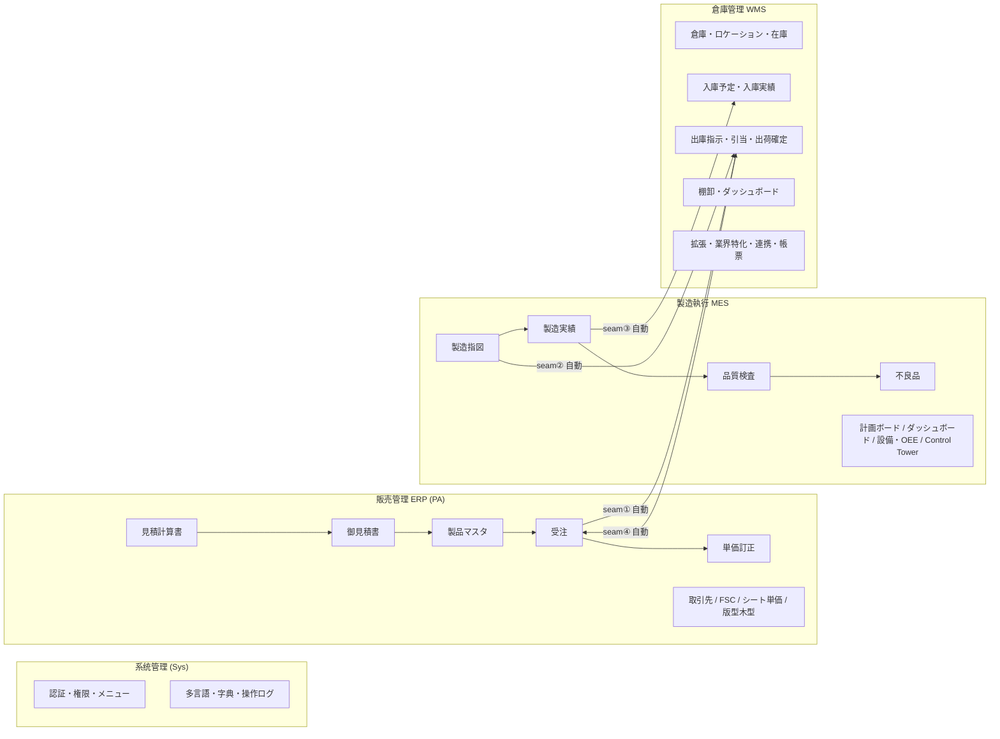

# CP6 全機能一覧 & ERP→MES→WMS 業務フロー

> **目的**：CP6（販売 ERP・製造 MES・倉庫 WMS 一体型システム）の全画面機能を一覧化し、
> 「見積 → 受注 → 製造 → 出荷」の一気通貫フローを実走ログ付きで記録する。
> **対象**：業務研修 / 新規参画メンバー / 受入確認 / 仕様レビュー。
> **状態**：2026-06-01 時点。Sys / ERP(PA) / MES / WMS(Phase 1〜5一部 + 拡張スキャフォールド) を収録。
> **基盤**：.NET 8 + EF Core 8 + SQL Server / Vue3 + TS + Element Plus + vue-i18n + SignalR。
> ※ mcframe7 連携は対象外（恒久的にスコープ外）。

---

## 0. システム全景

実線 `seam①〜④` が ERP/MES/WMS を自動連動させる **Bridge Hook**（best-effort、本書「2. 業務フロー」「3. 連動接縫」参照）。

---

## 1. 全機能一覧

ログイン：`admin / 123456`。サイドバーは 5 大ブロック（仪表盘 / 系统管理 / 販売管理(ERP) / 製造執行(MES) / 倉庫管理(WMS)）。

### 1.0 仪表盘（業務経営総覧）

| 画面 | ルート | 機能 | 主要 API |
|---|---|---|---|
| 仪表盘 | `/dashboard` | ログイン後のランディング。本日/今月受注・在制指図・本月完工・出荷待ち・在庫警告・承認待ち・製品総数の横断 KPI。各カードクリックで該当照会画面へ遷移。SignalR で業務通知をリアルタイム購読。 | `GET /api/dashboard` |

### 1.1 系统管理（Sys）

| 画面 | ルート | 機能 | 主要 API |
|---|---|---|---|
| 角色管理 | `/role` | ロール（役割）の CRUD と説明・有効フラグ管理。 | `/api/role` |
| 菜单管理 | `/menu` | メニューツリーの CRUD（親子・並び順・アイコン・ルート）。 | `/api/menu` |
| 权限分配 | `/permission` | ロール×メニューの権限割当（RoleMenu）。 | `/api/permission` |
| 用户管理 | `/user` | ユーザーの CRUD・ロール紐付・有効化。 | `/api/user` |
| 多语言管理 | `/lang` | i18n 辞書（Sys_Langs）管理。フロントは `/api/lang/{code}` を起動時ロード。 | `/api/lang` |
| 数据字典 | `/dict` | 区分値マスタ（汎用コード）管理。 | `/api/dict` |
| 操作日志 | `/operlog` | 操作ログ照会。ログは **Kafka 専任**で収集（業務通知は RabbitMQ→SignalR）。 | `/api/operlog` |

### 1.2 販売管理 ERP（PA）

| # | 画面 | ルート | 機能 | 主要 API |
|---|---|---|---|---|
| PA010 | 見積計算書 照会 | `/estimate-calc-list` | 内部見積（採算試算）の一覧・検索・並び替え。 | `GET /api/estimate-calcs` |
| PA010 | 見積計算書 登録 | `/estimate-calc` | 面積×原紙単価×段成率でコスト試算。8 数量段・工程明細・標準/見積/確定単価。QtnDiv=20 で「決定見積」。 | `POST /api/estimate-calcs`・`/calculate`・`/{no}/copy` |
| PA030 | 御見積書 一覧 | `/quotation-list` | 客先提出版の一覧・状態（未承認/承認済/確定）絞込。 | `GET /api/quotations` |
| PA040 | 御見積書 登録 | `/quotation` | 複数の決定見積を 1 冊に束ねて提出。確定登録・発行帳票。 | `POST /api/quotations`・`/{no}/confirm`・`/issue` |
| PA050 | 製品マスタ 一覧 | `/product-list` | 確定製品の一覧・CSV 出力。 | `GET /api/products`・`/export.csv` |
| PA060 | 製品マスタ 登録 | `/product` | 5 表（部材・基本情報・工程・連産品・材料・ロット単価）を 1 提交。見積計算書NO 紐付時は承認待ち(Status=0)。サーバ採番 `PRD…`。 | `POST /api/products`・`/next-seq`・`/by-quotation/{no}` |
| PA070 | 受注一覧照会 | `/order-list` | 受注の一覧・検索・出荷状況確認。 | `GET /api/orders` |
| PA070 | 受注入力 | `/order` | 客先確定オーダー（製品×数量×納期×単価）。**作成時に seam① で WMS 出荷指示を自動生成**。 | `POST /api/orders` |
| PA090 | 単価訂正 | `/order-price-correction` | 受注後の単価一括訂正。変更理由記録＋ワークフロー起票。 | `GET /api/orders/price-correction/list`・`PUT …/batch` |
| PA100 | FSC チェックシート | `/fsc-checklist` | 森林認証エビデンス管理。 | `/api/fsc-checklist` |
| PA110 | 取引先マスタ 一覧 | `/business-partner-list` | 客先・仕入先・配送先を 1 テーブル＋フラグで管理（一覧）。 | `GET /api/business-partner` |
| PA120 | 取引先マスタ 登録 | `/business-partner` | 取引先 CRUD。 | `POST /api/business-partner` |
| PA130 | シート単価マスタ | `/sheet-unit-price` | 紙質×印刷×加工 13 項目複合キーで段ボール単価決定。 | `/api/sheet-unit-price` |
| PA140 | 版型/木型 一覧 | `/plate-mold-list` | 印版・トムソン木型の一覧。 | `GET /api/plate-mold` |
| PA150 | 版型/木型 登録 | `/plate-mold` | 版型・木型の登録（受注時に流用）。 | `POST /api/plate-mold` |

### 1.3 製造執行 MES

| # | 画面 | ルート | 機能 | 主要 API |
|---|---|---|---|---|
| ME010 | 生産計画ボード | `/mes/planning-board` | ガントチャートで指図を時間軸可視化。ドラッグでリスケ。 | `GET /api/mes/planning-board`・`PUT …/reschedule` |
| ME020 | 製造指図 入力 | `/mes/work-order` | 受注から展開 or 手動作成（工程×材料）。**発行(issue)時に seam② で WMS 材料出庫を自動生成**。 | `POST /api/mes/work-orders`・`/{no}/issue` |
| ME030 | 製造指図 一覧 | `/mes/work-order-list` | 指図の一覧・状態追跡。 | `GET /api/mes/work-orders` |
| ME040 | 製造実績 入力 | `/mes/production-result` | 工程別の開始/中断/再開/完了・良品数/不良数。**全工程完了で seam③ により WMS 完成品入庫を自動生成**。 | `POST /api/mes/production-results/{start,complete,…}` |
| ME050 | 製造実績 一覧 | `/mes/production-result-list` | 実績の一覧・進捗照会。 | `GET /api/mes/production-results` |
| ME060 | 品質検査 入力 | `/mes/quality-inspection` | テンプレート連動の項目別検査・合否判定。 | `POST /api/mes/quality-inspection` |
| ME070 | 品質検査 一覧 | `/mes/quality-inspection-list` | 検査記録の一覧。 | `GET /api/mes/quality-inspection` |
| ME080 | 不良品管理 | `/mes/defect` | 不良分類・是正処置・ステータス追跡。 | `/api/mes/defect` |
| ME090 | MESダッシュボード | `/mes/dashboard` | KPI・進捗・遅延アラート（SignalR push）。 | `GET /api/mes/dashboard` |
| ME-P4 | 設備管理 | `/mes/machine-list` | 設備マスタ・稼働状態。 | `/api/mes/machines` |
| ME-P4 | OEE 分析 | `/mes/oee` | 設備総合効率（可用率×性能×品質）日次集計。 | `/api/mes/oee` |
| ME-P4 | Control Tower 大屏 | `/mes/control-tower` | 現場大型ディスプレイ用フルスクリーン（standalone モードあり）。 | （MES 各 API 集約） |

### 1.4 倉庫管理 WMS

**コア（Phase 1〜4：実装済）**

| # | 画面 | ルート | 機能 | 主要 API |
|---|---|---|---|---|
| WM010 | 倉庫マスタ | `/wms/warehouse` | 倉庫の区分・マイナス許可など。 | `/api/wms/warehouse` |
| WM010 | ロケーション管理 | `/wms/location` | 棚位（ゾーン→ビン）の階層管理。 | `/api/wms/location` |
| WM020 | 在庫照会 | `/wms/stock` | 物理/引当/利用可能在庫・変動履歴・棚移動。手動 IN/OUT 申請。 | `GET /api/wms/stock`・`POST /api/wms/stock/apply` |
| WM030 | 入庫予定 一覧 | `/wms/inbound-order-list` | 入庫予定（発注/製造）の一覧。 | `GET /api/wms/inbound-order` |
| WM030 | 入庫予定 登録 | `/wms/inbound-order` | 入庫予定の作成。 | `POST /api/wms/inbound-order` |
| WM040 | 入庫実績 入力 | `/wms/inbound-receipt` | 入庫検収・上架。**seam③ の自動入庫はここに `SourceType=PRODUCTION` で生成される**。 | `/api/wms/inbound-receipt` |
| WM050 | 出庫指示 一覧 | `/wms/outbound-order-list` | 出庫指示（材料出庫=Type1 / 出荷=Type2）の一覧。 | `GET /api/wms/outbound-order` |
| WM050 | 出庫指示 登録 | `/wms/outbound-order` | 出庫指示の作成・確認・引当(FIFO+期限優先)・出荷確定(梱包採番)。 | `POST /api/wms/outbound-order`・`/{no}/{confirm,allocate,ship}` |
| WM090 | 棚卸 一覧 | `/wms/stock-take-list` | 棚卸計画の一覧。 | `GET /api/wms/stock-take` |
| WM090 | 棚卸 作業 | `/wms/stock-take` | 計画→カウント→承認→ADJ の 4 段階フロー。 | `/api/wms/stock-take/*` |
| WM-DASH | WMSダッシュボード | `/wms/dashboard` | KPI・トレンド・在庫金額・アラート。 | `GET /api/wms/dashboard/*` |

**Phase 5 一部（実装済）**

| 画面 | ルート | 機能 | 主要 API |
|---|---|---|---|
| 入荷検品(QC) | `/wms/inspection` | 入荷時の QC 検品（PASS で自動入庫）。 | `/api/wms/qc-inspection` |
| 返品管理(RMA) | `/wms/rma` | 5 段階返品ワークフロー。 | `/api/wms/rma` |
| 賞味期限管理(FEFO) | `/wms/expiry` | 期限切迫一覧・一括廃棄。 | `/api/wms/expiry` |
| モバイル作業指示 | `/wms/mobile-task` | ハンディ端末向けスキャン作業（MobileTask）。 | `/api/wms/mobile` |

**拡張・業界特化・連携・帳票（スキャフォールド／占位＝画面＋API 雛形、業務ロジックは今後実装）**

| ブロック | 画面（ルート） |
|---|---|
| WMS 拡張機能 | スロッティング最適化 `/wms/slotting`・補充指示 `/wms/replenish`・クロスドッキング `/wms/cross-dock`・キッティング・組立 `/wms/kit`・ロット追溯・回収 `/wms/lot-trace`・製品入庫 `/wms/product-inbound`・出荷指示 一覧/登録 `/wms/shipping-order(-list)`・ピッキング `/wms/picking`・梱包出荷 `/wms/packaging` |
| 業界特化(紙器) | 原紙ロール `/wms/paper-roll`・残材端材 `/wms/remnant`・印版木型倉庫 `/wms/plate-mold-stock`・インキ接着剤 `/wms/ink-lot`・パレット `/wms/pallet`・客先預り在庫VMI `/wms/vmi`・試作サンプル `/wms/sample-stock` |
| 連携・モバイル | WCS/自動倉庫 `/wms/wcs-task`・配送業者 `/wms/carrier`・IoT温湿度 `/wms/iot-monitor` |
| 帳票分析 | 帳票センター `/wms/report-center` |

---

## 2. ERP→MES→WMS 一気通貫フロー（実走記録）

下記は実 API を叩いて DB に書き込んだ実走結果（モックなし）。本書末尾の手順スクリプトで再現可能。

### 2.1 実走で生成された伝票番号（RUN=0244125 / 2026-06-01）

| # | 区分 | 業務操作 | 伝票番号 | 主要データ |
|---|---|---|---|---|
| ① | ERP | 見積計算書 登録 | `EMC2026060002-01` | 確定単価 12.5 円/枚、QtnDiv=20 |
| ② | ERP | 御見積書 登録 → 確定 | `QTN2026060002-01` | 合計 12,500、①を関連 |
| ③ | ERP | 製品マスタ 登録 | `PRD20260600020001` | Status=0（承認待ち）、①②紐付 |
| ④ | ERP | 受注入力 | `ORD2026060004` | 数量 1000、単価 12.5 |
| └① | *自動* | **seam① 出荷指示** | `OUT2026060005` | OutboundType=2、webOrderNo 紐付 |
| ⑤ | ERP | 単価訂正 | （ORD…004 明細）| 12.5→**13.8**、WF 起票 1 件 |
| ⑥ | MES | 製造指図 作成 → 発行 | `WO2026060002` | Status 0→2、数量 1000 |
| └② | *自動* | **seam② 材料出庫** | `OUT2026060006` | OutboundType=1、workOrderNo 紐付 |
| ⑦ | MES | 製造実績 完了 | `PR2026060004` | 良品 1000、全工程完了 |
| └③ | *自動* | **seam③ 完成品入庫** | `RC2026060003` | SourceType=PRODUCTION、在庫 +1000 |
| ⑧ | WMS | 入庫（在庫補充）| `TXN…` | IN 5000 → W01/W01-FG |
| ⑨ | WMS | 出荷 確認→引当→出荷確定 | `PKG2026060002` | 出荷 1000、在庫 6000→5000 |
| └④ | *自動* | **seam④ 受注回写** | （ORD…004）| shipStatus=**9（全出荷）**、shippedQty=1000、単価 13.8 |

### 2.2 ステップ別の業務的意味

**ERP フロント（営業）**
1. **見積計算書**：面積×原紙単価×段成率でコスト試算。確定単価を出し、QtnDiv=20 で「決定見積」化。
2. **御見積書**：決定見積を 1 冊に束ねて客先提出。確定登録は関連計算書が全て決定済であることを検証（未決定なら MSG-003）。
3. **製品マスタ**：受注内定後に品番登録。見積計算書NO 紐付で承認待ち（仪表盘「承認待ち」KPI の発生源）。
4. **受注入力**：客先正式発注。→ **seam① で WMS 出荷指示を自動生成**（倉庫が「何を出すか」を前広に把握）。
5. **単価訂正**：受注後の改価（12.5→13.8）。変更理由を記録し承認ワークフロー起票。出荷回写時の明細単価で反映を確認。

**MES 製造**
6. **製造指図 発行**：受注に基づき指図を発行（Status 0→2）。→ **seam② で材料出庫を BOM 自動生成**（現場の手作業ゼロ）。
7. **製造実績 完了**：良品数を報告し全工程完了。→ **seam③ で完成品入庫を自動生成・上架**（成品在庫 +1000）。

**WMS 出荷**
8. **入庫**：本デモは発送可能性を担保するため 5000 補充（在庫 6000）。
9. **出荷**：出庫指示を 確認→引当→出荷確定。梱包 `PKG…002` 採番、在庫 −1000（6000→5000）。
   → **seam④ で WebOrderNo+ProductCd 一致をキーに受注へ回写**：shipStatus=9（全出荷）、shippedQty=1000。

### 2.3 検証ポイント

- **データ貫通**：①→②→③→④ が QtnCalcNo / QtnNo / ProductCd で全鎖紐付。受注明細に EstimateCalcNo+QuotationNo を保持。
- **改価クローズド**：単価訂正 12.5→13.8 が承認起票され、最終的に出荷回写の受注明細で確認できる。
- **在庫実態整合**：6000（5000 補充 + 1000 自動入庫）− 1000 出荷 = 5000、増減精確。
- **4 接縫すべて発火**：受注 1 件＋指図 1 件＋報告 1 回で WMS 3 伝票（出荷指示/材料出庫/完成品入庫）＋受注回写を自動派生、手動起票ゼロ。

---

## 3. 連動接縫（Bridge Hook）

| 接縫 | トリガー | 実装 | 生成物 |
|---|---|---|---|
| **seam①** 受注 → 出荷指示 | `OrderService.CreateAsync` 末尾 | `IWmsBridgeHook.OnOrderCreatedAsync` | 出荷指示（OutboundType=2、webOrderNo 紐付） |
| **seam②** 指図発行 → 材料出庫 | `WorkOrderService.IssueAsync` 末尾 | `IWmsBridgeHook.OnWorkOrderIssuedAsync` | 材料出庫指示（OutboundType=1、workOrderNo 紐付） |
| **seam③** 製造完了 → 完成品入庫 | `ProductionResultService.CompleteAsync`（全工程完了時） | `IWmsBridgeHook.OnProductionCompletedAsync` | 完成品入庫（InboundReceipt、SourceType=PRODUCTION） |
| **seam④** 出荷確定 → 受注回写 | 出荷確定時 | `IErpBridgeHook.OnShipmentConfirmedAsync` | 受注 ShipStatus/ShippedQty 更新（明細9=全出荷/5=一部、ヘッダー集約） |

**設計原則**
- すべて **best-effort**：Hook が例外を投げても親操作（受注作成・指図発行・出荷確定）は成功する。
- 有効化：`appsettings.json` の `WmsBridge:Enabled=true`（出荷指示/材料出庫/完成品入庫）。
- `MesBridge`（受注→製造指図 自動展開）は既定 **無効**（NoOpMesBridgeHook）。製造指図は手動作成が既定運用。
- mcframe7 連携は実装しない（恒久スコープ外）。

---

## 4. 付録

### 4.1 テストデータ・接続

| 項目 | 値 |
|---|---|
| 管理者ログイン | `admin` / `123456` |
| Backend | <http://localhost:5177/swagger> |
| Frontend | <http://localhost:5173> |
| DB | `localhost\KOUSQLSERVER` / `CP6DB` / Windows 認証 |
| サンプル倉庫/棚位 | `W01` / `W01-FG`（完成品）、`DW01` / `DEMO-RAW-A-01`（資材） |
| サンプル取引先 | `ASAHI` |
| サンプル材料 | `GLUE-A` |

### 4.2 一気通貫フローの再現（最小手順）

1. `POST /api/auth/login` → token（トップレベル）。
2. `POST /api/estimate-calcs`（qtnDiv=20）→ QtnCalcNo。
3. `POST /api/quotations`（calcs に QtnCalcNo）→ `POST /api/quotations/{no}/confirm`。
4. `POST /api/products`（members に estimateCalcNo/quotationNo）→ ProductCd 採番。
5. `POST /api/orders`（productCd=ProductCd）→ WebOrderNo（seam① 自動出荷指示）。
6. `GET /api/orders/price-correction/list?baseCd=01&productCd=…` → `PUT /api/orders/price-correction/batch`（単価訂正）。
7. `POST /api/mes/work-orders` → `POST /api/mes/work-orders/{no}/issue`（seam② 自動材料出庫）。
8. `POST /api/mes/production-results/start` → `/complete`（seam③ 自動完成品入庫）。
9. `POST /api/wms/stock/apply`（IN 補充）。
10. `POST /api/wms/outbound-order/{ship}/confirm` → `/allocate` → `/ship`（seam④ 受注回写）。

> API エンベロープ：業務 API は `{code:0, message, data}`。認証ログインは `token` をトップレベル。ダッシュボードは生オブジェクト。

---

— Last updated: 2026-06-01 — ERP→MES→WMS 一気通貫 実走検証時点 —
