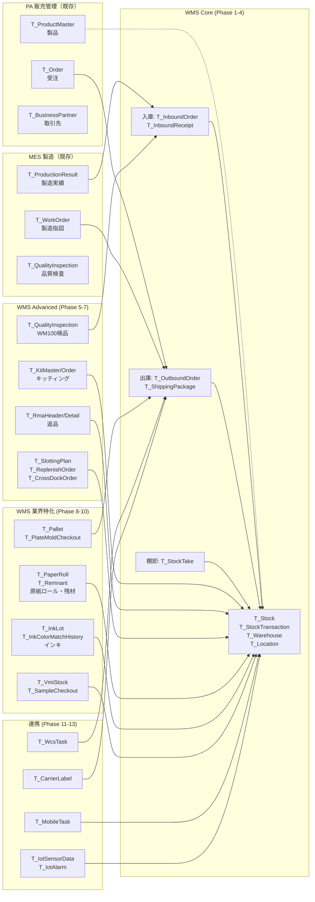
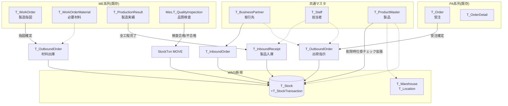
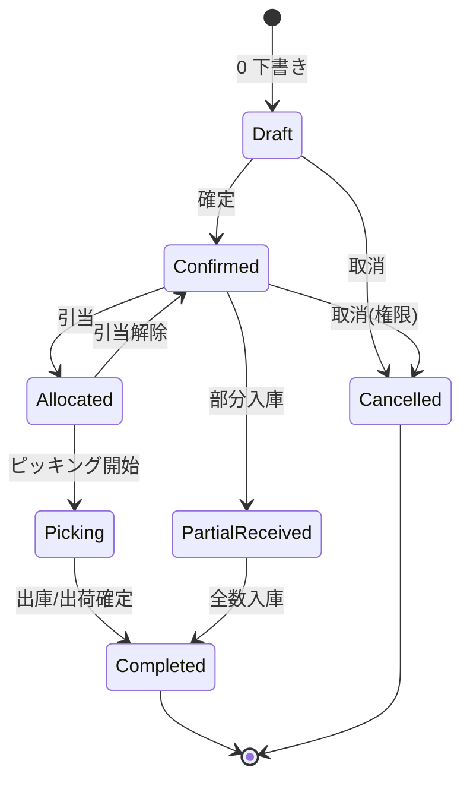
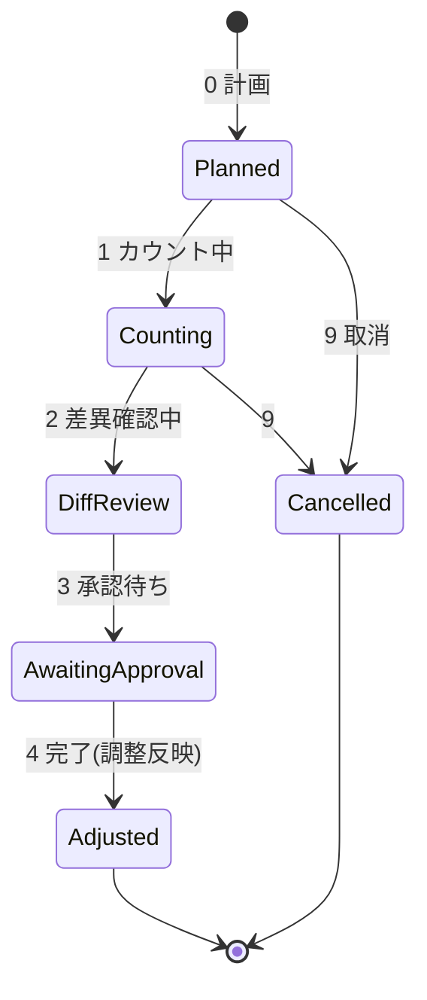
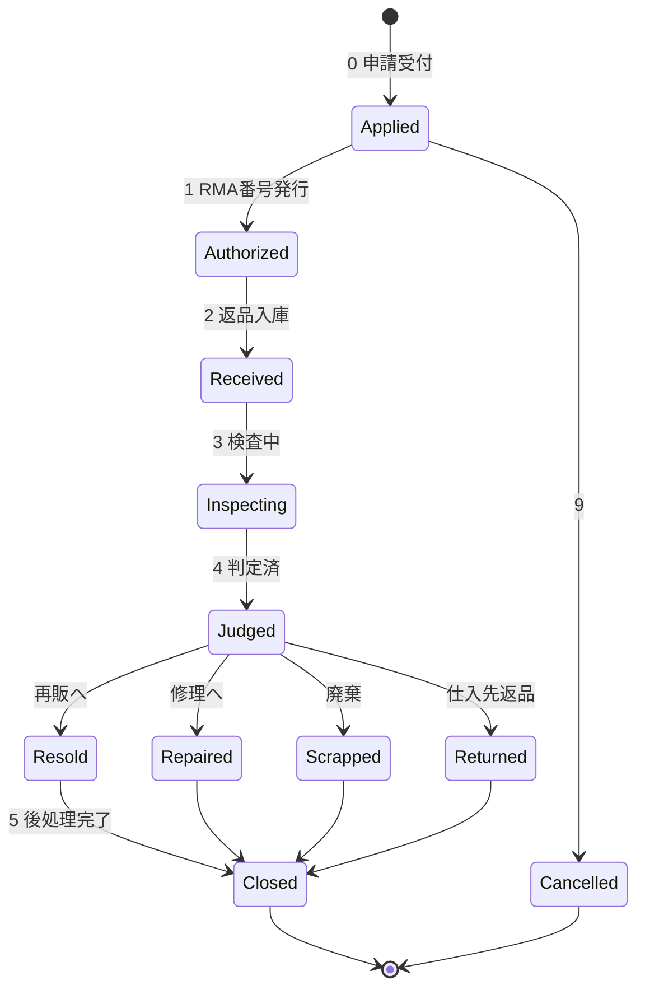

# MSBBWM WMS ER 図集

> CP6 WMS モジュール全テーブル（V1.1、約 40 テーブル）の ER 図。
> Mermaid 記法。GitHub / VSCode の Markdown プレビューでそのまま描画可能。
>
> 関連仕様書：[MSBBWM_Requirements.txt](MSBBWM_Requirements.txt)

## 凡例

| 記号 | 意味 |
|---|---|
| `\|\|--o{` | 1 対 多（必須対任意） |
| `\|\|--\|{` | 1 対 多（必須対必須） |
| `}o--o{` | 多 対 多 |
| `}\|..\|{` | ソフト参照（FK制約なし、業務上の関連） |
| `PK` | 主キー（Id Guid） |
| `BK` | 業務キー（一意制約） |
| `FK` | 外部キー |
| `UK` | ユニーク制約 |

凡例的にすべての WMS テーブルは `BaseBizEntity` を継承し、共通項目
`Id (Guid PK)` / `Creator` / `CreateDate` / `Modifier` / `ModifyDate` / `DelFlg` / `BaseCd`
を持つ。図では業務固有の列のみ記載する。

---

## 0. 全体概覧（モジュール群レベル）



---

## 1. コアモデル — 在庫・倉庫・ロケーション

WMS の心臓部。`T_Stock` への書き込みは `StockMovementService` のみが許可され、すべての変動は `T_StockTransaction` に不変記録される。

```mermaid
erDiagram
    T_Warehouse ||--o{ T_Location : "包含"
    T_Location ||--o{ T_Location : "親子階層"
    T_Location ||--o{ T_Stock : "保管"
    T_ProductMaster ||--o{ T_Stock : "在庫対象"
    T_Stock ||--o{ T_StockTransaction : "変動履歴"
    T_Warehouse ||--o{ T_StockTransaction : "発生倉庫"
    T_Location ||--o{ T_StockTransaction : "発生棚位"
    T_WmsSequence ||--o{ T_StockTransaction : "採番"

    T_Warehouse {
        guid Id PK
        string WarehouseCd BK "3桁英数字"
        string WarehouseName
        int WarehouseType "1原料 2半製品 3成品 4不良 5外注"
        string BaseCd FK
        string ManagerCd FK
        bool AllowNegative "既定 false"
    }

    T_Location {
        guid Id PK
        string LocationCd BK "倉庫CD+階層キー"
        string WarehouseCd FK
        string ParentLocationCd FK "親ロケーション"
        int LocationLevel "1ゾーン~5ビン"
        int XCoord
        int YCoord
        int ZCoord
        decimal CapacityQty
        string AllowedProductType
        bool IsPickable
        bool IsBlocked "凍結中"
        string Barcode
    }

    T_Stock {
        guid Id PK
        string WarehouseCd UK "(W,L,P,Lot) UNIQUE"
        string LocationCd UK
        string ProductCd UK "FK→ProductMaster"
        string LotNo UK
        decimal PhysicalQty "decimal(21,8)"
        decimal AllocatedQty "引当中"
        decimal AvailableQty "Physical-Allocated"
        DateTime ReceiveDate
        DateTime ExpiryDate "FEFO用"
        decimal UnitPrice
        bool RecallFlag "リコール対象"
        string OwnerType "SELF/CUSTOMER"
        string OwnerCd "VMI客先CD"
        string PaperRollNo "FK→PaperRoll"
        bytes RowVersion "楽観ロック"
    }

    T_StockTransaction {
        guid Id PK
        string TxnNo BK "TXNYYYYMMDD-NNNNN"
        string TxnType "IN/OUT/MOVE/ADJ/RSV/UNRSV"
        DateTime TxnDateTime
        string WarehouseCd FK
        string LocationCd FK
        string ProductCd FK
        string LotNo
        decimal Qty
        decimal UnitPrice
        string RelatedNo "関連伝票NO"
        string OperatorCd FK
        string Remark
        string ReceiptInspectionNo "WM100連携"
        string KitOrderNo "WM140連携"
        string RmaNo "WM150連携"
        bool CrossDockFlag
        string PaperRollNo
        decimal ConsumedLengthM "原紙消費長"
    }

    T_WmsSequence {
        guid Id PK
        string Prefix BK "IN/RC/OUT/SHIP/PKG/ST/QC/RMA/PLT/ROLL"
        string DateKey "YYYYMMDD"
        int NextNo
    }

    T_ProductMaster {
        guid Id PK
        string ProductCd BK
        string ProductName
        string DefaultWarehouseCd
        string DefaultLocationCd
        int LotControlType "1指定 2自動 3不要"
        decimal SafetyStockQty
        decimal ReorderPointQty
        bool HasExpiryDate
        int InspectionLevel "AQL"
    }
```

---

## 2. 入庫フロー

予定 → 検品 → 実績 → `Stock` 更新 の流れ。

```mermaid
erDiagram
    T_BusinessPartner ||--o{ T_InboundOrder : "仕入先"
    T_InboundOrder ||--|{ T_InboundOrderDetail : "明細"
    T_InboundOrder ||--o{ T_QualityInspection : "受入検品"
    T_QualityInspection ||--|{ T_QualityInspectionItem : "検査項目"
    T_InboundOrder ||--o{ T_InboundReceipt : "実績"
    T_InboundReceipt ||--|{ T_InboundReceiptDetail : "実績明細"
    T_InboundReceipt ||--o{ T_StockTransaction : "IN発生"
    T_ProductMaster ||--o{ T_InboundOrderDetail : "対象製品"
    T_ProductMaster ||--o{ T_InboundReceiptDetail : "対象製品"

    T_InboundOrder {
        guid Id PK
        string InboundNo BK "INYYYYMMDD-NNNN"
        int InboundType "1購買 2外注戻 3返品 9その他"
        string SupplierCd FK
        string PoNo "発注書NO"
        DateTime ExpectedArrival
        string WarehouseCd
        int Status "0~9"
    }

    T_InboundOrderDetail {
        guid Id PK
        string InboundNo FK
        int LineNo
        string ProductCd FK
        string LotNo
        decimal ExpectedQty
        string UnitCd
        string ExpectedLocation
        decimal UnitPrice
        string Remark
    }

    T_QualityInspection {
        guid Id PK
        string InspectionNo BK "QC-YYYYMMDD-NNNN"
        string InboundNo FK
        string SupplierCd
        DateTime ArrivalDateTime
        string InspectorCd FK
        string FinalJudgement "合格/条件付/保留/不合格/即返品"
        string PhotoUrls
    }

    T_QualityInspectionItem {
        guid Id PK
        string InspectionNo FK
        int ItemNo
        string ProductCd
        decimal ExpectedQty
        decimal ReceivedQty
        decimal AcceptedQty
        decimal RejectedQty
        decimal PendingQty
        string DefectReasonCd
        string InspectionItemJson "AQL明細"
    }

    T_InboundReceipt {
        guid Id PK
        string ReceiptNo BK "RCYYYYMMDD-NNNN"
        string InboundNo FK "null=直入"
        string SourceType "PURCHASE/PRODUCTION/RMA"
        string WorkOrderNo FK "WM060連携時"
        DateTime ReceiveDate
        string OperatorCd FK
    }

    T_InboundReceiptDetail {
        guid Id PK
        string ReceiptNo FK
        int LineNo
        string ProductCd FK
        string LotNo
        decimal ReceivedQty
        string LocationCd
        decimal UnitPrice
        string PaperRollNo "WM200連携"
    }
```

---

## 3. 出庫・出荷フロー

生産材料の払出（WM050）・客先出荷（WM070/080）共通モデル。`OutboundType` で区別。

```mermaid
erDiagram
    T_WorkOrder ||--o{ T_OutboundOrder : "材料出庫元"
    T_Order ||--o{ T_OutboundOrder : "出荷元受注"
    T_OutboundOrder ||--|{ T_OutboundOrderDetail : "明細"
    T_OutboundOrder ||--o{ T_StockTransaction : "RSV/OUT発生"
    T_OutboundOrder ||--o{ T_ShippingPackage : "梱包"
    T_ShippingPackage ||--o{ T_CarrierLabel : "送り状"
    T_BusinessPartner ||--o{ T_OutboundOrder : "客先(出荷)"

    T_OutboundOrder {
        guid Id PK
        string OutboundNo BK "OUTYYYYMMDD-NNNN"
        int OutboundType "1材料 2出荷 3振替 9その他"
        string WorkOrderNo FK "材料出庫時"
        string WebOrderNo FK "出荷時"
        string CustomerCd FK
        string WarehouseCd
        DateTime PlannedDate
        int Status "0下書~4出庫済~9取消"
        int Priority "1通常 2急 3特急"
    }

    T_OutboundOrderDetail {
        guid Id PK
        string OutboundNo FK
        int LineNo
        string ProductCd FK
        decimal RequiredQty
        decimal AllocatedQty
        decimal PickedQty
        decimal ShippedQty
        string LotNo "引当時自動"
        string LocationCd "引当時自動"
        string UnitCd
    }

    T_ShippingPackage {
        guid Id PK
        string PackageNo BK "PKGYYYYMMDD-NNNN"
        string OutboundNo FK
        int CaseQty
        decimal TotalWeightKg
        decimal TotalVolumeM3
        string CarrierCd
        string TrackingNo
        DateTime DepartureTime
        string PalletNo "FK→Pallet"
    }

    T_CarrierLabel {
        guid Id PK
        string LabelNo BK
        string PackageNo FK
        string CarrierCd "YAMATO/SAGAWA/FUKUTSU/SELF"
        string TrackingNo
        decimal Cost
        string LabelImageUrl
        DateTime IssuedAt
    }
```

---

## 4. 棚卸 & 補助モジュール

```mermaid
erDiagram
    T_StockTake ||--|{ T_StockTakeDetail : "明細"
    T_StockTakeDetail ||--o{ T_StockTransaction : "ADJ発生"
    T_ReplenishOrder ||--o{ T_StockTransaction : "MOVE発生"
    T_CrossDockOrder ||--o{ T_StockTransaction : "IN+OUT"
    T_SlottingPlan ||--o{ T_SlottingPlanItem : "推奨移動"
    T_Stock ||--o{ T_StockTakeDetail : "対象在庫"

    T_StockTake {
        guid Id PK
        string StockTakeNo BK "STYYYYMMDD-NNN"
        int StockTakeType "1全 2サイクル 3臨時"
        DateTime PlannedDate
        DateTime ActualDate
        int Status "0計画~4完了~9取消"
        string TargetWarehouseCd
        string TargetLocationCd
        string TargetProductCategory
    }

    T_StockTakeDetail {
        guid Id PK
        string StockTakeNo FK
        guid StockId FK
        string LocationCd
        string ProductCd
        string LotNo
        decimal BookQty "帳簿数(固定)"
        decimal CountedQty
        decimal DiffQty
        string DiffReason
        decimal DiffAmount
        int ApprovalStatus
    }

    T_ReplenishOrder {
        guid Id PK
        string ReplenishNo BK "RPLYYYYMMDD-NNNN"
        int Priority "1至急 2通常"
        string ProductCd
        string FromLocationCd "保管棚"
        string ToLocationCd "ピッキング棚"
        decimal Qty
        int Status
    }

    T_CrossDockOrder {
        guid Id PK
        string CrossDockNo BK "XDYYYYMMDD-NNNN"
        string InboundNo FK
        string ShippingNo FK
        string FromDock
        string ToDock
        string OperatorCd FK
    }

    T_SlottingPlan {
        guid Id PK
        string PlanNo BK
        DateTime AnalyzePeriodFrom
        DateTime AnalyzePeriodTo
        string AnalyzeMode "QTY/AMOUNT/COUNT"
        int Status "0提案 1承認 2適用済"
    }

    T_SlottingPlanItem {
        guid Id PK
        string PlanNo FK
        string ProductCd
        string CurrentLocationCd
        string RecommendedLocationCd
        decimal BenefitScore
    }
```

---

## 5. キッティング & 返品 (RMA) & 追溯

```mermaid
erDiagram
    T_KitMaster ||--|{ T_KitMasterComponent : "BOM"
    T_KitMaster ||--o{ T_KitOrder : "組立指示"
    T_KitOrder ||--o{ T_StockTransaction : "OUT(部品)+IN(キット)"
    T_ProductMaster ||--o{ T_KitMaster : "キットSKU"
    T_ProductMaster ||--o{ T_KitMasterComponent : "構成部品"

    T_RmaHeader ||--|{ T_RmaDetail : "明細"
    T_RmaDetail ||--o{ T_StockTransaction : "IN(返品)+MOVE(振分)"
    T_Order ||--o{ T_RmaHeader : "原出荷"
    T_BusinessPartner ||--o{ T_RmaHeader : "顧客"

    T_KitMaster {
        guid Id PK
        string KitSku BK "FK→ProductMaster"
        string KitName
        bool AllowSubstitute
    }

    T_KitMasterComponent {
        guid Id PK
        string KitSku FK
        int LineNo
        string ComponentProductCd FK
        decimal RequiredQty
        bool IsOptional
    }

    T_KitOrder {
        guid Id PK
        string KitOrderNo BK "KITYYYYMMDD-NNNN"
        string KitSku FK
        decimal OrderQty
        string Direction "ASSEMBLE/DISASSEMBLE"
        int Status
        string OperatorCd FK
    }

    T_RmaHeader {
        guid Id PK
        string RmaNo BK "RMAYYYYMMDD-NNNN"
        string CustomerCd FK
        string OriginalShippingNo FK
        string ReturnReason
        DateTime ReturnDate
        int Status "0申請~5後処理完了~9取消"
    }

    T_RmaDetail {
        guid Id PK
        string RmaNo FK
        int LineNo
        string ProductCd FK
        string LotNo
        decimal Qty
        string ConditionLevel "新品/未使用/開封/破損"
        string Judgement "再販/修理/廃棄/仕入先返品"
        string DestLocationCd
    }
```

ロット追溯（WM160）は専用テーブルを持たず、`T_StockTransaction` を再帰的に辿る純粋クエリ機能（ビュー）。リコール時のみ `T_Stock.RecallFlag` を立てる。

---

## 6. 業界特化（紙器包装業）

```mermaid
erDiagram
    T_ProductMaster ||--o{ T_PaperRoll : "紙質マスタ"
    T_PaperRoll ||--o{ T_PaperRoll : "スリッター親子"
    T_PaperRoll ||--o{ T_StockTransaction : "消費履歴"
    T_PaperRoll ||--o{ T_Remnant : "残材発生元"
    T_Location ||--o{ T_PaperRoll : "保管位置"

    T_InkLot ||--o{ T_InkLot : "混合ロット親子"
    T_InkLot ||--o{ T_InkColorMatchHistory : "色合わせ"
    T_BusinessPartner ||--o{ T_InkColorMatchHistory : "客先別配合"

    T_Pallet ||--o{ T_PalletItem : "積載品"
    T_Pallet ||--o{ T_ShippingPackage : "梱包紐付"

    T_PlateMold ||--o{ T_PlateMoldCheckout : "貸出履歴"
    T_WorkOrder ||--o{ T_PlateMoldCheckout : "使用指図"

    T_ProductMaster ||--o{ T_SampleCheckout : "サンプル元"
    T_Staff ||--o{ T_SampleCheckout : "貸出先営業"

    T_Stock ||--o{ T_VmiStock : "VMI拡張属性"
    T_BusinessPartner ||--o{ T_VmiStock : "VMI所有客先"

    T_PaperRoll {
        guid Id PK
        string RollNo BK "ROLLYYYYMMDD-NNNNN"
        string PaperGrade "K280/K210/SK"
        int WidthMm "905/1100/1310"
        decimal BasisWeight "g/m2"
        string GrainDirection "T目/Y目"
        decimal OriginalLengthM
        decimal RemainingLengthM
        decimal CoreDiameterInch
        DateTime MfgDate
        string MfgLotNo "製紙会社ロット"
        string SupplierRollNo
        string LocationCd FK
        string ParentRollNo "スリッター元"
        int Status "0在庫 1使用中 2残米 3廃棄"
    }

    T_Remnant {
        guid Id PK
        string RemnantNo BK "RMNYYYYMMDD-NNNNN"
        string SourceType "端ロール/打抜残/試刷残/余剰"
        string SourceOrderNo
        decimal SizeWidth
        decimal SizeHeight
        string PaperGrade
        decimal Qty
        string ConditionLevel
        string LocationCd
        DateTime ExpiryDate "60日"
    }

    T_InkLot {
        guid Id PK
        string InkLotNo BK
        string ColorCode "DIC-XXX/Pantone-XXX"
        string InkType "オフセット/フレキソ/UV"
        string OpenStatus "未開封/開封済"
        DateTime ExpiryDate
        decimal ViscosityCp
        decimal SolidContent
        string ParentLotNoA "混合元A"
        string ParentLotNoB "混合元B"
    }

    T_InkColorMatchHistory {
        guid Id PK
        string MatchNo BK
        string CustomerCd FK
        string ColorCode
        string FormulaJson "配合比JSON"
        decimal ConsumedQty
        DateTime MatchedAt
        string OperatorCd
    }

    T_Pallet {
        guid Id PK
        string PalletNo BK "PLTYYYYMMDD-NNNNN"
        string ProductCd "1パレット1製品原則"
        string LotNo
        int CartonQty
        decimal WeightKg
        decimal HeightMm
        string LocationCd
        int Status "在庫/出荷待機/出荷済"
    }

    T_PalletItem {
        guid Id PK
        string PalletNo FK
        string ProductCd
        string LotNo
        decimal Qty
        int CartonQty
    }

    T_PlateMoldCheckout {
        guid Id PK
        string CheckoutNo BK
        string PlateMoldId FK
        string WorkOrderNo FK
        DateTime CheckoutAt
        DateTime ReturnedAt
        int ConditionLevelOnReturn "1良好~5要交換"
    }

    T_SampleCheckout {
        guid Id PK
        string CheckoutNo BK
        string ProductCd FK
        int SampleType "1試作 2営業 3展示 4苦情再現"
        string CheckoutToStaffCd FK
        string CustomerCd
        DateTime CheckoutAt
        DateTime DueDate
        DateTime ReturnedAt
    }

    T_VmiStock {
        guid Id PK
        guid StockId FK
        string OwnerCustomerCd FK
        DateTime VmiStartDate
        decimal DailyStorageRate "保管料単価"
        string BillingMode "PALLET/VOLUME"
    }
```

---

## 7. 連携・モバイル・IoT・帳票

```mermaid
erDiagram
    T_MobileTask ||--o{ T_MobileTaskLog : "ログ"
    T_Staff ||--o{ T_MobileTask : "作業者"

    T_WcsTask ||--o{ T_WcsTaskEvent : "イベント"

    T_IotSensor ||--o{ T_IotSensorData : "計測値"
    T_IotSensor ||--o{ T_IotAlarm : "警報"
    T_Warehouse ||--o{ T_IotSensor : "設置倉庫"
    T_Location ||--o{ T_IotSensor : "設置棚"

    T_ReportJob ||--o{ T_ReportFile : "出力ファイル"

    T_MobileTask {
        guid Id PK
        string TaskNo BK
        string TaskType "RECEIVE/PUTAWAY/PICK/COUNT/MOVE"
        string AssignedStaffCd FK
        string RelatedNo "関連業務NO"
        int Status "0未着 1着手 2完了 9中止"
        DateTime AssignedAt
        DateTime CompletedAt
    }

    T_MobileTaskLog {
        guid Id PK
        string TaskNo FK
        DateTime LoggedAt
        string Action "SCAN/INPUT/SKIP"
        string PayloadJson
    }

    T_WcsTask {
        guid Id PK
        string WcsTaskNo BK
        string Direction "WMS_TO_WCS/WCS_TO_WMS"
        string EquipmentType "AGV/ASRS/CONVEYOR"
        string FromLocationCd
        string ToLocationCd
        string ProductCd
        decimal Qty
        int Status
    }

    T_WcsTaskEvent {
        guid Id PK
        string WcsTaskNo FK
        DateTime EventAt
        string EventType "SENT/ACCEPTED/STARTED/COMPLETED/FAILED"
        string DetailJson
    }

    T_IotSensor {
        guid Id PK
        string SensorId BK
        string SensorType "TEMP/HUMID/COMBO"
        string WarehouseCd FK
        string LocationCd FK
        decimal TempLowerLimit
        decimal TempUpperLimit
        decimal HumidLowerLimit
        decimal HumidUpperLimit
    }

    T_IotSensorData {
        guid Id PK
        string SensorId FK
        DateTime MeasuredAt
        decimal TempCelsius
        decimal HumidPercent
        string Granularity "RAW/HOURLY/DAILY"
    }

    T_IotAlarm {
        guid Id PK
        string SensorId FK
        DateTime RaisedAt
        string AlarmType "OUT_OF_RANGE/RAPID_CHANGE/SENSOR_DOWN"
        decimal ObservedValue
        bool Acknowledged
        DateTime AckedAt
        string AckedBy
    }

    T_ReportJob {
        guid Id PK
        string JobNo BK
        string ReportId "WM-RPT-01~10"
        string ParametersJson
        string Status "QUEUED/RUNNING/DONE/FAILED"
        DateTime QueuedAt
        DateTime CompletedAt
        string RequestedBy
    }

    T_ReportFile {
        guid Id PK
        string JobNo FK
        string FilePath
        string FileFormat "PDF/XLSX"
        long FileSizeBytes
        DateTime ExpiresAt "30日保持"
    }
```

---

## 8. 外部モジュール（PA/MES/共通）との連携マップ

`T_Stock` を中心に "誰が触るか" を俯瞰する図。FK ではなくビジネスフロー上の関連を示す。



### 連携の追加列まとめ

| 既存テーブル | 追加列 | 目的 |
|---|---|---|
| `T_ProductMaster` | `DefaultWarehouseCd` / `DefaultLocationCd` | 自動棚配置 |
| `T_ProductMaster` | `LotControlType` (1/2/3) | ロット採番方針 |
| `T_ProductMaster` | `SafetyStockQty` / `ReorderPointQty` | 補充トリガ |
| `T_ProductMaster` | `HasExpiryDate` / `InspectionLevel` | FEFO / AQL |
| `T_Order` | `WmsShippingStatus` (0~3) | 出荷進捗 |
| `T_WorkOrder` | `WmsOutboundCreated` (bool) | 出庫指示生成済フラグ |
| `T_PlateMold` | `LocationCd` / `LastUsedDate` / `UsageCount` / `ConditionLevel` | WMS統合 |

---

## 9. ステータス遷移サマリ



棚卸ステータス（WM090）：



RMA ライフサイクル（WM150）：



---

## 10. インデックス設計の重要点

| テーブル | インデックス | 理由 |
|---|---|---|
| `T_Stock` | `(WarehouseCd, LocationCd, ProductCd, LotNo)` UNIQUE | 業務PK + 重複防止 |
| `T_Stock` | `(ProductCd, ExpiryDate)` | FEFO 引当 |
| `T_Stock` | `(ProductCd, OwnerType, OwnerCd)` | VMI 分離検索 |
| `T_StockTransaction` | `(TxnDateTime DESC)` | 履歴照会 |
| `T_StockTransaction` | `(ProductCd, LotNo, TxnDateTime)` | ロット追溯 |
| `T_StockTransaction` | `(RelatedNo)` | 伝票からの逆引き |
| `T_Location` | `(WarehouseCd, ParentLocationCd)` | ツリー走査 |
| `T_PaperRoll` | `(PaperGrade, WidthMm, GrainDirection, Status)` | 適合ロール検索 |
| `T_PaperRoll` | `(RemainingLengthM)` | 残米最小優先 |
| `T_IotSensorData` | `(SensorId, MeasuredAt DESC)` | 時系列クエリ |
| `T_IotSensorData` | `(MeasuredAt, Granularity)` | パーティション候補 |

---

## 11. 集計ビュー（DB Side）

頻繁にアクセスする集計は SQL ビューで物化候補：

```sql
-- V_StockAvailable: 引当可能在庫
CREATE VIEW V_StockAvailable AS
SELECT WarehouseCd, LocationCd, ProductCd, LotNo,
       PhysicalQty - AllocatedQty AS AvailableQty,
       ExpiryDate, ReceiveDate
FROM T_Stock
WHERE DelFlg = 0 AND RecallFlag = 0;

-- V_ProductStockSummary: 製品別在庫サマリ
CREATE VIEW V_ProductStockSummary AS
SELECT ProductCd,
       SUM(PhysicalQty) AS TotalPhysical,
       SUM(AllocatedQty) AS TotalAllocated,
       SUM(PhysicalQty - AllocatedQty) AS TotalAvailable,
       COUNT(DISTINCT LocationCd) AS LocationCount,
       MIN(ExpiryDate) AS NearestExpiry
FROM T_Stock
WHERE DelFlg = 0
GROUP BY ProductCd;

-- V_MesWipCheck: MES連携の仕掛チェック拡張（PA050用）
CREATE VIEW V_MesWipCheck AS
SELECT s.ProductCd, SUM(s.PhysicalQty) AS WipQty
FROM T_Stock s
INNER JOIN T_Warehouse w ON s.WarehouseCd = w.WarehouseCd
WHERE w.WarehouseType IN (2, 4) -- 半製品 or 不良品
  AND s.DelFlg = 0
GROUP BY s.ProductCd
HAVING SUM(s.PhysicalQty) > 0;
```

---

— 文档结束  MSBBWM WMS ER 図集 V1.1 —
