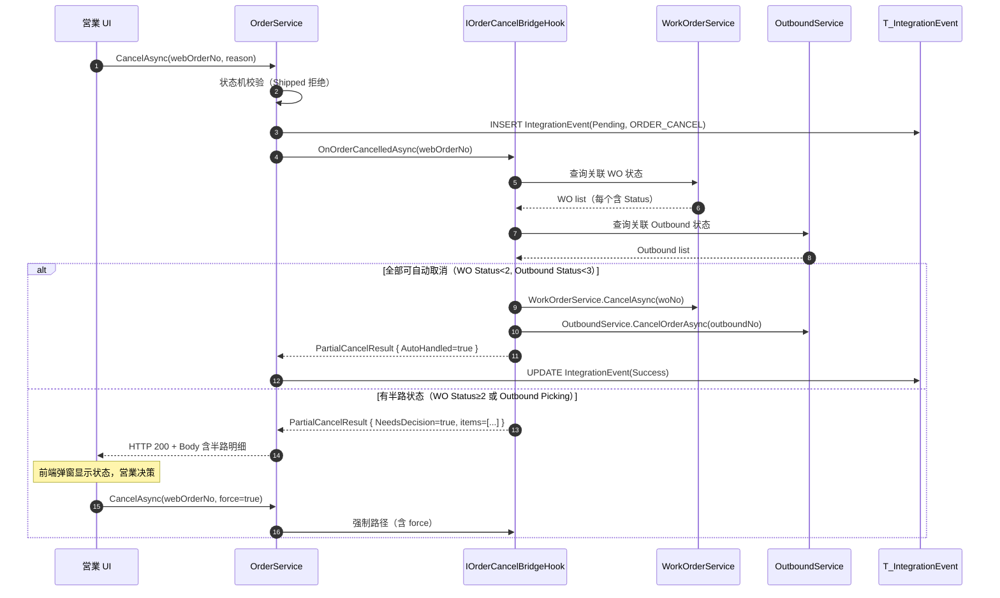
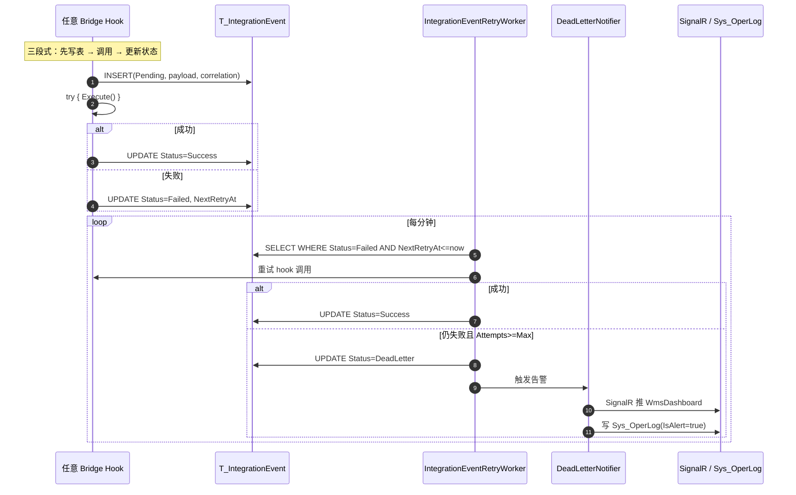

# Phase 6 — Order Cancel 链 + IntegrationEvent 持久化

> **状态**: SPEC（未实装）
> **生成于**: 2026-06-03，via gstack `/spec` skill
> **关联文档**: [PROJECT_IMPROVEMENT_PLAN.md](./PROJECT_IMPROVEMENT_PLAN.md) §三 Phase 6 / [PROJECT_STRUCTURE.md](./PROJECT_STRUCTURE.md) §2.3 Bridge Hook
> **前置闭环**: Phase 1-4 Bridge Hook 已落地（参照 memory `project_closed_loop.md`）
> **明确不做**: mcframe7 連携（Phase 5）；与本期无关

---

## Context

CP6 当前闭环只覆盖**正路径**（受注 → 指図 → 入出库 → 出荷回写）。两个 P0 漏洞使系统无法上生产：

1. **`IOrderService` 完全没有 `CancelAsync` 方法**（grep 53 个公开方法均无 cancel 字样）。客户取消订单只能软删除 `OrderService.DeleteAsync`，已展开的 `WorkOrder` / `OutboundOrder` 不会反向解锁，造成库存幽灵引当 + MES 继续排产。
2. **三个 Bridge Hook 失败后只 `_logger.LogError` 吞异常**（`WmsBridgeHook.cs:38` / `ErpBridgeHook.cs:107` / `MesBridgeHook.cs:43`）。没人主动查日志就丢失了，无重试、无 DLQ、无可观测性 — 这是 demo 级别可接受但生产不可。

本期补齐这两个洞，让 CP6 从演示级走到生产可上线级。

## Decisions（4 个关键拍板）

| # | 问题 | 选择 | 理由 |
|---|---|---|---|
| Q1 | Done 定义 | **B**：Code + dotnet test 全绿 + Phase 6 新增 e2e 集成测试通过 | 文档可后置（spec 本身即文档），但 e2e 测试是 P0 修复的唯一可信验证 |
| Q2 | 取消半路状态决策权 | **B**：二段确认 — Bridge Hook 返回当前 WO/Outbound 状态，前端弹窗让営業看了再决定 | A 强制中断会与工厂打架；C 状态阻断把负担推回営業；B 是 ERP 行业标准 |
| Q3 | IntegrationEvent 重试策略 | **C**：appsettings 配置驱动，默认指数退避 5 次（1m/2m/4m/8m/16m） | 多一个 struct field 换未来调参自由；默认值覆盖 ~30 分钟够吸收临时故障 |
| Q4 | DeadLetter 通知方式 | **C**：SignalR 推 WmsDashboard + 写入 `Sys_OperLog` 标记 `IsAlert=true` | 复用既有 OperLogFilter 基础设施，0 新依赖（Email 需要 SMTP 配置 + 凭据管理，不值） |

## Current State（已验证，2026-06-03）

| 项 | 文件 / 行 | 现状 |
|---|---|---|
| `IOrderService` 接口 | `CP6.Core/Services/IOrderService.cs` 全 100 行 | 53 个公开方法，**无 Cancel** |
| `OrderService.Status` 字段含义 | `OrderService.cs:139` 注释 `Status = 0` 即 "0=未転送" | mcframe7 转送相关，与 Cancel 正交，不动 |
| `Order.ShipStatus` 字段 | `OrderService.cs:1210` 已存在 | Phase 4 Bridge Hook 用，可直接复用语义 |
| `IWorkOrderService.CancelAsync` | `CP6.Core/Services/Mes/IWorkOrderService.cs` | **不存在** |
| `WorkOrder.Status` 数值 | `WorkOrder.cs:22` + `WorkOrderService.cs:328/399` | 0=新建, 1=確定済（受注展開直後）, 2=発行済（IssueAsync 后）, 4=完了, 6/9=既存终态（已被 `WorkOrderService.cs:81` 当 "非遅延" 处理） |
| `OutboundOrderStatus` enum | `WmsTxnType.cs:83-91` | 0=Draft, 1=Confirmed, 2=Allocated, 3=Picking, 4=Completed, **9=Cancelled** |
| WMS 端 `CancelOrderAsync` | `OutboundService.cs:239-280` | 已实装。状态守卫 "完了済の指示は取消不可"（行 246），含引当解除（行 254 释放 RSV） |
| Bridge Hook 失败处理 | `WmsBridgeHook.cs` / `ErpBridgeHook.cs` / `MesBridgeHook.cs` | 3 层 try/catch：业务异常 → `Skipped`，技术异常 → `Failed` + `_logger.LogError`。无 DB 持久化。 |
| 已有测试模式 | `CP6.Tests/WmsErpClosedLoopTests.cs` / `MesBridgeHookTests.cs` / `WmsBridgeHookTests.cs` | xUnit + Moq + InMemory DB（注意 `ConfigureWarnings(Ignore(InMemoryEventId.TransactionIgnoredWarning))`） |
| EF 迁移基线 | `CP6.Core/Migrations/20260531153048_RemoveArticleAndDashboardRevamp` | Phase 6 在此之后新增 |
| DI 注册位置 | `CP6.WebApi/Program.cs:83-114` | `AddScoped<IXxxService, XxxService>()` 集中段 |

---

## Proposed Change

### 架构图





---

### 数据模型变更

#### 新表 `T_IntegrationEvent`

```csharp
namespace CP6.Entity.DomainModels;

[Table("T_IntegrationEvent")]
public class IntegrationEvent : BaseBizEntity
{
    /// <summary>来源模块：ERP / MES / WMS</summary>
    [Required, MaxLength(10)]
    public string SourceModule { get; set; } = string.Empty;

    /// <summary>目标模块：ERP / MES / WMS</summary>
    [Required, MaxLength(10)]
    public string TargetModule { get; set; } = string.Empty;

    /// <summary>Hook 全限定名：MesBridgeHook.OnOrderCreatedAsync</summary>
    [Required, MaxLength(100)]
    public string HookName { get; set; } = string.Empty;

    /// <summary>源业务单号（受注号/指図号/出库号）</summary>
    [Required, MaxLength(30)]
    public string SourceNo { get; set; } = string.Empty;

    /// <summary>目标业务单号（成功时填）</summary>
    [MaxLength(30)]
    public string? TargetNo { get; set; }

    /// <summary>状态：见 IntegrationEventStatus 常量</summary>
    [Required, MaxLength(15)]
    public string Status { get; set; } = IntegrationEventStatus.Pending;

    /// <summary>已尝试次数</summary>
    public int Attempts { get; set; } = 0;

    /// <summary>最后一次异常 ToString()</summary>
    public string? LastError { get; set; }

    /// <summary>下次重试时间（UTC）</summary>
    public DateTime? NextRetryAt { get; set; }

    /// <summary>串联同一业务链（受注→指図→出库→回写 共享同一 GUID）</summary>
    public Guid CorrelationId { get; set; }

    /// <summary>触发时的入参 JSON（重试用）</summary>
    public string PayloadJson { get; set; } = "{}";
}

public static class IntegrationEventStatus
{
    public const string Pending = "PENDING";
    public const string Success = "SUCCESS";
    public const string Skipped = "SKIPPED";      // 业务规则跳过，不重试
    public const string Failed = "FAILED";        // 待重试
    public const string DeadLetter = "DEAD";      // 重试用尽
    public const string Compensated = "COMPENSATED"; // 人工补偿后关闭
}
```

**索引**：
- `IX_IntegrationEvent_Status_NextRetryAt`（Worker 扫表用，过滤 Failed + Retry due）
- `IX_IntegrationEvent_CorrelationId`（端到端 trace 用）
- `IX_IntegrationEvent_SourceNo`（按业务号查询用）

#### `Order` 字段新增

| 字段 | 类型 | 说明 |
|---|---|---|
| `Order.OrderStatus` | string(10) | 状态机：`Confirmed` / `InProduction` / `Shipped` / `Cancelled` / `PartiallyCancelled`。默认 `Confirmed`。**与既有 `Status` (mc転送) 字段并存，互不影响** |
| `Order.CancelledAt` | DateTime? | 取消时间戳 |
| `Order.CancelReason` | string(200)? | 取消原因 |

#### `WorkOrder` 字段（无新增）

`WorkOrder.Status` 复用既有 int：增加 `7 = Cancelled` 常量。新 enum class：

```csharp
public static class WorkOrderStatus
{
    public const int Draft = 0;
    public const int Confirmed = 1;
    public const int Issued = 2;
    public const int InProgress = 3;
    public const int Completed = 4;
    public const int Cancelled = 7;  // 新增
    // 6, 9 保持既有语义不动
}
```

#### `OutboundOrder` 字段（无变更）

`OutboundOrderStatus.Cancelled = 9` 已存在，复用。

---

### 接口契约

#### `IOrderService.CancelAsync`

```csharp
public interface IOrderService
{
    // ... 既有 53 个方法 ...

    /// <summary>
    /// 受注取消（Phase 6 新增）。
    /// </summary>
    /// <param name="webOrderNo">受注号</param>
    /// <param name="reason">取消理由（必填，写入 OperLog 审计）</param>
    /// <param name="force">false=二段确认模式（有半路状态返回 NeedsDecision 不修改任何数据），
    ///                     true=强制中断（业务方确认后调用）</param>
    /// <param name="userName">操作人</param>
    /// <returns>OrderCancelResult — Outcome / NeedsDecision items / 关联 WO/Outbound 列表 + 当前状态</returns>
    Task<OrderCancelResult> CancelAsync(
        string webOrderNo, string reason, bool force, string? userName);
}

public class OrderCancelResult
{
    public CancelOutcome Outcome { get; init; }   // Cancelled / NeedsDecision / Rejected
    public string? Message { get; init; }
    public List<WorkOrderProbe> RelatedWorkOrders { get; init; } = new();
    public List<OutboundProbe> RelatedOutbounds { get; init; } = new();
    public Guid CorrelationId { get; init; }
}

public enum CancelOutcome { Cancelled, NeedsDecision, Rejected }
public class WorkOrderProbe { public string No; public int Status; public bool AutoCancellable; }
public class OutboundProbe  { public string No; public int Status; public bool AutoCancellable; }
```

**状态机校验**（OrderService 内部）：
- `Order.OrderStatus` 已是 `Shipped` / `Cancelled` → 返回 `Rejected`
- `force=false` 且任一 WO `Status >= Issued (2)` 或任一 Outbound `Status >= Picking (3)` → 返回 `NeedsDecision`，**不修改任何数据**
- `force=true` 或全部 WO/Outbound 均可自动取消 → 执行级联取消

#### `IOrderCancelBridgeHook`

```csharp
namespace CP6.Core.Services;

public interface IOrderCancelBridgeHook
{
    /// <summary>
    /// 受注取消触发的反向级联。
    /// force=false: 仅返回当前状态，不修改任何数据。
    /// force=true:  对所有 AutoCancellable=true 的 WO / Outbound 执行 cancel。
    /// </summary>
    Task<OrderCancelHookResult> OnOrderCancelledAsync(
        string webOrderNo, bool force, string? userName, Guid correlationId);
}

public class OrderCancelHookResult
{
    public bool Success { get; init; }
    public List<WorkOrderProbe> WorkOrders { get; init; } = new();
    public List<OutboundProbe> Outbounds { get; init; } = new();
    public string? Message { get; init; }
}

// 配置可禁用：appsettings OrderCancelBridge:Enabled=false → NoOpOrderCancelBridgeHook
public class NoOpOrderCancelBridgeHook : IOrderCancelBridgeHook { /* 返回 Skipped */ }
```

#### `IWorkOrderService.CancelAsync`

```csharp
public interface IWorkOrderService
{
    // ... 既有 ...
    /// <summary>受注取消連動：未着手の指図を取消す。Status < 3 のみ可。それ以上は InvalidOperationException</summary>
    Task<bool> CancelAsync(string workOrderNo, string reason, string? userName);
}
```

实装规则（`WorkOrderService.CancelAsync`）：
- `Status >= InProgress (3)` → throw `InvalidOperationException("ME-MSG-CANCEL-001: 着手済の指図は取消不可")`
- `Status in {Draft, Confirmed, Issued}` → 释放材料引当（调 `IStockMovementService` 反向出 RSV 解除）+ 设 `Status = Cancelled (7)`
- 既有 `IWmsBridgeHook.OnWorkOrderIssuedAsync` 创建的 `OutboundOrder`（材料出庫指示）—— **WO Cancel 不直接级联 Outbound Cancel**（解耦：Outbound 取消由 `IOrderCancelBridgeHook` 上层统筹），但记录关联给 hook 看

#### 三段式 Bridge Hook 持久化（通用基类）

```csharp
public abstract class BridgeHookBase
{
    private readonly CP6Context _db;
    private readonly ILogger _logger;

    protected async Task<TResult> ExecuteWithPersistenceAsync<TResult>(
        string sourceModule, string targetModule, string hookName,
        string sourceNo, Guid correlationId, object payload,
        Func<Task<(bool Success, string? TargetNo, string? SkippedReason, string? FailedReason)>> action)
    where TResult : class
    {
        var evt = new IntegrationEvent
        {
            SourceModule = sourceModule, TargetModule = targetModule, HookName = hookName,
            SourceNo = sourceNo, CorrelationId = correlationId,
            PayloadJson = JsonSerializer.Serialize(payload),
            Status = IntegrationEventStatus.Pending, Attempts = 1,
            Creator = "system", CreateDate = DateTime.UtcNow,
        };
        _db.IntegrationEvents.Add(evt);
        await _db.SaveChangesAsync();

        try
        {
            var (success, targetNo, skipped, failed) = await action();
            evt.TargetNo = targetNo;
            evt.Status = skipped != null ? IntegrationEventStatus.Skipped
                       : success ? IntegrationEventStatus.Success
                       : IntegrationEventStatus.Failed;
            evt.LastError = failed ?? skipped;
            if (evt.Status == IntegrationEventStatus.Failed)
                evt.NextRetryAt = ComputeNextRetry(evt.Attempts);
        }
        catch (Exception ex)
        {
            evt.Status = IntegrationEventStatus.Failed;
            evt.LastError = ex.ToString();
            evt.NextRetryAt = ComputeNextRetry(evt.Attempts);
            _logger.LogError(ex, "[{Hook}] persistence-wrapped failure on {SourceNo}", hookName, sourceNo);
        }
        await _db.SaveChangesAsync();
        // 返回外层封装结果（具体 hook 决定 TResult 形状）
    }

    private DateTime ComputeNextRetry(int attempts) { /* 配置驱动：见下 */ }
}
```

**所有既有 Hook（`WmsBridgeHook` / `ErpBridgeHook` / `MesBridgeHook`）改造为继承 `BridgeHookBase` 并通过 `ExecuteWithPersistenceAsync` 包裹原 try/catch**。外部接口签名不变，调用方无感。

#### Retry Worker

```csharp
public class IntegrationEventRetryWorker : BackgroundService
{
    private readonly IServiceScopeFactory _scopeFactory;
    private readonly ILogger<IntegrationEventRetryWorker> _logger;
    private readonly IntegrationEventOptions _opts;

    protected override async Task ExecuteAsync(CancellationToken stoppingToken)
    {
        while (!stoppingToken.IsCancellationRequested)
        {
            using var scope = _scopeFactory.CreateScope();
            var db = scope.ServiceProvider.GetRequiredService<CP6Context>();
            var dispatcher = scope.ServiceProvider.GetRequiredService<IIntegrationEventDispatcher>();
            var deadLetterNotifier = scope.ServiceProvider.GetRequiredService<IDeadLetterNotifier>();

            var due = await db.IntegrationEvents
                .Where(e => e.Status == IntegrationEventStatus.Failed
                         && e.NextRetryAt <= DateTime.UtcNow
                         && e.Attempts < _opts.MaxAttempts)
                .OrderBy(e => e.NextRetryAt)
                .Take(50)
                .ToListAsync(stoppingToken);

            foreach (var evt in due)
            {
                evt.Attempts++;
                try { await dispatcher.DispatchAsync(evt); evt.Status = IntegrationEventStatus.Success; }
                catch (Exception ex) {
                    evt.LastError = ex.ToString();
                    evt.NextRetryAt = ComputeBackoff(evt.Attempts);
                    if (evt.Attempts >= _opts.MaxAttempts) {
                        evt.Status = IntegrationEventStatus.DeadLetter;
                        await deadLetterNotifier.NotifyAsync(evt);
                    }
                }
            }
            await db.SaveChangesAsync(stoppingToken);
            await Task.Delay(TimeSpan.FromSeconds(_opts.PollIntervalSeconds), stoppingToken);
        }
    }
}
```

**appsettings.json**:
```json
{
  "IntegrationEvent": {
    "MaxAttempts": 5,
    "BackoffSeconds": [60, 120, 240, 480, 960],
    "PollIntervalSeconds": 60
  },
  "OrderCancelBridge": { "Enabled": true }
}
```

#### `IIntegrationEventDispatcher`（按 HookName 反射调用）

```csharp
public interface IIntegrationEventDispatcher
{
    Task DispatchAsync(IntegrationEvent evt);
    // 内部：根据 evt.HookName 路由到 IMesBridgeHook / IWmsBridgeHook / IErpBridgeHook / IOrderCancelBridgeHook
    // 解析 PayloadJson 还原参数，调用对应 hook 方法
}
```

#### `IDeadLetterNotifier`

```csharp
public interface IDeadLetterNotifier { Task NotifyAsync(IntegrationEvent evt); }

public class DeadLetterNotifier : IDeadLetterNotifier
{
    private readonly IHubContext<WmsDashboardHub> _hub;
    private readonly CP6Context _db;

    public async Task NotifyAsync(IntegrationEvent evt)
    {
        // 1) SignalR 推 WmsDashboard
        await _hub.Clients.All.SendAsync("IntegrationDeadLetter", new {
            evt.HookName, evt.SourceNo, evt.LastError, evt.Attempts });

        // 2) 写 Sys_OperLog 标记告警（复用既有审计设施）
        _db.Sys_OperLogs.Add(new Sys_OperLog {
            Method = "BACKGROUND",
            Path = $"/integration-event/{evt.Id}",
            Body = $"DEAD_LETTER hook={evt.HookName} source={evt.SourceNo} attempts={evt.Attempts}",
            StatusCode = 500,
            IsAlert = true,  // 新增字段：管理员查询时过滤
            Creator = "system", CreateDate = DateTime.UtcNow,
        });
        await _db.SaveChangesAsync();
    }
}
```

`Sys_OperLog` 加 `IsAlert bool default false`，OperLog UI 加「告警过滤」开关。

---

## Acceptance Criteria

1. `IOrderService.CancelAsync(webOrderNo, reason, force=false, userName)` 存在并通过 xUnit 单元测试。
2. 当 `Order.OrderStatus = Shipped` 时调 `CancelAsync` → 返回 `Outcome = Rejected`，不修改任何数据。
3. 当关联 WO `Status >= Issued (2)` 时 `force=false` → 返回 `Outcome = NeedsDecision`，含 WO 列表 + 各自 `AutoCancellable`，**DB 完全无变化**。
4. `force=true` + 关联 WO `Status in {Draft, Confirmed, Issued}` → WO `Status = Cancelled (7)` 且材料引当（`RSV` 记录）反向释放。
5. `force=true` + 关联 Outbound `Status in {Draft, Confirmed, Allocated}` → 通过既有 `OutboundService.CancelOrderAsync` 取消，引当释放。
6. `Order.OrderStatus` 取消成功后变为 `Cancelled`（或半路 `PartiallyCancelled` 当有 WO 不可自动取消时）+ `CancelledAt` + `CancelReason` 填充。
7. `T_IntegrationEvent` 表存在；每次 hook 调用产生 1 条记录，状态 ∈ {Pending, Success, Skipped, Failed, DeadLetter, Compensated}。
8. Hook 失败时 `T_IntegrationEvent.Status = Failed` + `NextRetryAt = now + 60s`（首次失败）+ `LastError` 含完整异常 stack。
9. `IntegrationEventRetryWorker` 启动后每 60s 扫一次 `Failed AND NextRetryAt <= now`；可观察到 `Attempts++` 和 `NextRetryAt` 推移（1m → 2m → 4m → 8m → 16m）。
10. 5 次失败后 `Status = DeadLetter`，SignalR 客户端收到 `IntegrationDeadLetter` 事件，`Sys_OperLog` 新增 1 条 `IsAlert=true` 记录。
11. `appsettings.json` 设 `OrderCancelBridge:Enabled = false` → DI 注入 `NoOpOrderCancelBridgeHook`，CancelAsync 仍走但不级联（返回 Skipped）。
12. `dotnet test` 全绿（既有 192 用例 + 本期新增）。
13. E2E 集成测试：`OrderCancel_FullCascade_E2ETest` 创建受注 → 通过既有 MesBridge 展开 WO + Outbound → 调 CancelAsync(force=true) → 断言 WO/Outbound 全部 Cancelled + 引当全部释放 + 4 条 IntegrationEvent 记录（Order 创建时 + Cancel 时）。
14. 无 regressions：Phase 1-4 的既有测试 `MesBridgeHookTests`/`WmsBridgeHookTests`/`WmsErpClosedLoopTests` 全绿。

---

## Testing Plan

| 层 | 测试名 | 覆盖 | 数 |
|---|---|---|---|
| Unit | `OrderServiceCancelTests` | 状态机校验 / Rejected / NeedsDecision / 强制取消路径 / OrderStatus 转换 | +8 |
| Unit | `WorkOrderServiceCancelTests` | Cancel 状态守卫 / 材料引当释放 / Status=7 | +4 |
| Unit | `OrderCancelBridgeHookTests` | force=false 探测 / force=true 级联 / NoOp 实装 / 配置禁用 | +5 |
| Unit | `IntegrationEventPersistenceTests` | 三段式生命周期 / Skipped vs Failed 分类 / Backoff 计算 | +6 |
| Unit | `IntegrationEventRetryWorkerTests` | 扫表查询 / 重试 / DeadLetter 转换 / Notifier 触发 | +4 |
| Unit | `DeadLetterNotifierTests` | SignalR 推送 / OperLog 写入 | +2 |
| Integration | `OrderCancel_FullCascade_E2ETest` | 创建受注 → MesBridge 展开 → Cancel(force=true) → 全链断言 | +1 |
| Integration | `IntegrationEvent_RetryThenDeadLetter_E2ETest` | 注入失败 mock → Worker 跑 5 轮 → DeadLetter + Notifier 触发 | +1 |
| Regression | 既有全部测试 | Phase 1-4 闭环不破 | 192 不动 |

合计新增约 **31 个测试**，覆盖目标 ≥85% Phase 6 新代码。

---

## Rollback Plan

| 风险 | 回退手段 |
|---|---|
| 取消链 bug 导致库存幽灵释放 | `appsettings.json` 设 `OrderCancelBridge:Enabled = false` → `CancelAsync` 仍可调但 Hook 返回 Skipped，旧路径 = 无 cancel；同时回滚 EF 迁移 |
| IntegrationEvent 写表压力大 | appsettings `IntegrationEvent:PollIntervalSeconds` 调大；极端情况下注释掉 `BridgeHookBase.ExecuteWithPersistenceAsync` 包装，回到纯 ILogger（每个 hook 一行注释切换）|
| Retry Worker 死循环 | `Program.cs` 注释掉 `AddHostedService<IntegrationEventRetryWorker>()`，重启即可 |
| EF 迁移失败 | `dotnet ef migrations remove` + `dotnet ef database update <Phase5迁移名>` 回退到 `20260531153048_RemoveArticleAndDashboardRevamp` |

---

## Effort Estimate

| 子任务 | 时长 |
|---|---|
| 1. Entity + EF Migration（`IntegrationEvent` + `Order.OrderStatus/CancelledAt/CancelReason` + `Sys_OperLog.IsAlert`） | 0.5d |
| 2. `WorkOrderService.CancelAsync` 实装 + 单元测试 | 0.5d |
| 3. `IOrderService.CancelAsync` 实装 + 状态机校验 + 单元测试 | 0.5d |
| 4. `IOrderCancelBridgeHook` 接口 + 标准实装 + NoOp 实装 + 单元测试 | 0.5d |
| 5. `BridgeHookBase` + 既有 3 hooks 改造接入持久化（不动接口签名）+ 单元测试 | 1.0d |
| 6. `IIntegrationEventDispatcher` 反射路由 + `IntegrationEventRetryWorker` BackgroundService + 单元测试 | 1.0d |
| 7. `IDeadLetterNotifier` + SignalR Hub 扩展 + OperLog 集成 + 单元测试 | 0.5d |
| 8. E2E 集成测试 2 个 | 0.5d |
| 9. 前端 ERP 受注列表加「取消」按钮 + 二段确认弹窗（中文 + 日文 + 4 国语言 i18n 种子） | 1.0d |
| 10. `Program.cs` DI 注册 + `appsettings*.json` 配置 + 文档更新 | 0.5d |

**合计：约 6 个工作日**（按 1 人节奏）

---

## Files Reference

### 新增

| 文件 | 用途 |
|---|---|
| `CP6.Entity/DomainModels/IntegrationEvent.cs` | 新表 entity + `IntegrationEventStatus` 常量 |
| `CP6.Entity/DTOs/OrderCancelDto.cs` | `OrderCancelResult` / `WorkOrderProbe` / `OutboundProbe` / `CancelOutcome` enum |
| `CP6.Core/Services/IOrderCancelBridgeHook.cs` | 接口 + `OrderCancelHookResult` + `NoOpOrderCancelBridgeHook` |
| `CP6.Core/Services/OrderCancelBridgeHook.cs` | 标准实装 |
| `CP6.Core/Services/BridgeHookBase.cs` | 三段式持久化抽象基类 |
| `CP6.Core/Services/IntegrationEventDispatcher.cs` | 反射路由器 |
| `CP6.Core/Services/IntegrationEventRetryWorker.cs` | BackgroundService |
| `CP6.Core/Services/DeadLetterNotifier.cs` | SignalR + OperLog 告警 |
| `CP6.Core/Options/IntegrationEventOptions.cs` | appsettings 绑定 |
| `CP6.Core/Migrations/<timestamp>_Phase6OrderCancelAndIntegrationEvent.cs` | EF 迁移 |
| `CP6.Tests/OrderServiceCancelTests.cs` | 单元测试 |
| `CP6.Tests/OrderCancelBridgeHookTests.cs` | 单元测试 |
| `CP6.Tests/IntegrationEventPersistenceTests.cs` | 单元测试 |
| `CP6.Tests/IntegrationEventRetryWorkerTests.cs` | 单元测试 |
| `CP6.Tests/Phase6E2ETests.cs` | 端到端集成测试 |
| `cp6.web/src/views/erp/OrderCancelDialog.vue` | 二段确认弹窗组件 |
| `docs/phase6-i18n-seed.sql` | 4 国语言种子 |

### 修改

| 文件 | 变更 |
|---|---|
| `CP6.Core/Services/IOrderService.cs:99` | 新增 `CancelAsync` 方法签名 |
| `CP6.Core/Services/OrderService.cs` | 实装 `CancelAsync` |
| `CP6.Core/Services/Mes/IWorkOrderService.cs` | 新增 `CancelAsync` 签名 |
| `CP6.Core/Services/Mes/WorkOrderService.cs` | 实装 `CancelAsync` + 加 `WorkOrderStatus` 常量类 + `Cancelled=7` |
| `CP6.Core/Services/Mes/MesBridgeHook.cs` | 继承 `BridgeHookBase`，调用 `ExecuteWithPersistenceAsync` |
| `CP6.Core/Services/Wms/WmsBridgeHook.cs` | 同上 |
| `CP6.Core/Services/Wms/ErpBridgeHook.cs` | 同上 |
| `CP6.Core/EFDbContext/CP6Context.cs` | 加 `DbSet<IntegrationEvent>` + 索引配置 |
| `CP6.Entity/DomainModels/Order.cs` | 加 `OrderStatus / CancelledAt / CancelReason` 字段 |
| `CP6.Entity/DomainModels/Sys_OperLog.cs` | 加 `IsAlert bool` |
| `CP6.WebApi/Program.cs:95-114` | 新增 DI：`IOrderCancelBridgeHook` + `IIntegrationEventDispatcher` + `IDeadLetterNotifier` + `AddHostedService<IntegrationEventRetryWorker>()` + `Configure<IntegrationEventOptions>` |
| `CP6.WebApi/appsettings.json` + `appsettings.Development.json` | 加 `IntegrationEvent` + `OrderCancelBridge` 段 |
| `CP6.WebApi/Controllers/OrderController.cs` | 加 `DELETE /api/orders/{webOrderNo}/cancel` 端点 |
| `cp6.web/src/api/order.ts` | 加 `cancelOrder(webOrderNo, reason, force)` 方法 |
| `cp6.web/src/views/erp/OrderListView.vue` | 列表行加「取消」按钮 → 弹 `OrderCancelDialog` |
| `docs/PROJECT_STRUCTURE.md` §2.3 | 加 `IOrderCancelBridgeHook` 一行 |
| `docs/business-flow-walkthrough.md` | 补「取消路径」章节 |

---

## Implementation Phase Order（建议执行顺序）

```
1. Entity + Migration (T_IntegrationEvent + Order.OrderStatus + Sys_OperLog.IsAlert)
   ↓
2. WorkOrderService.CancelAsync (含单测)
   ↓
3. IOrderCancelBridgeHook + 实装 + NoOp (含单测)
   ↓
4. IOrderService.CancelAsync + 状态机 (含单测)
   ↓
5. BridgeHookBase + 改造既有 3 hooks (含单测，不破 Phase 1-4 回归)
   ↓
6. IntegrationEventDispatcher + RetryWorker + DeadLetterNotifier (含单测)
   ↓
7. E2E 集成测试 2 个 (Phase6E2ETests)
   ↓
8. OrderController endpoint + 前端 OrderCancelDialog + i18n 种子
   ↓
9. Program.cs DI + appsettings + 文档更新
```

每一步独立可提交（建议每步一个 commit），便于 cherry-pick / revert。

---

## Out of Scope（明确不做）

- 取消后通知客户（邮件/短信） — 留给 Phase 11 客户通信
- 取消后的会计科目调整（凭证冲销） — ERP 财务模块未引入
- mcframe7 連携取消转送 — 已确认全期不做
- 退货（RMA）路径 — 见 Gap 1.4，留给 Phase 10
- 材料短缺反流告警 — 见 Gap 1.2，留给 Phase 9
- 跨模块端到端 trace 前端时间轴 UI — Gap 2.2 留给 Phase 7（本期落地了底座 `CorrelationId`）
- Bridge 健康监控 dashboard — Gap 2.3 留给 Phase 10

## Related

- [PROJECT_IMPROVEMENT_PLAN.md](./PROJECT_IMPROVEMENT_PLAN.md) — 完整改进路线 Phase 6-10
- [PROJECT_STRUCTURE.md](./PROJECT_STRUCTURE.md) — Phase 1-4 闭环架构
- memory `project_closed_loop.md` — Bridge Hook Phase 1-4 实装记录

---

*生成于 2026-06-03，via gstack `/spec` skill (Phase 1-5 完整流程)。*
