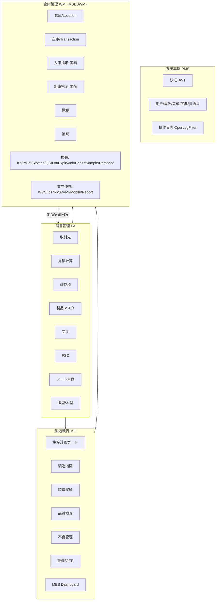
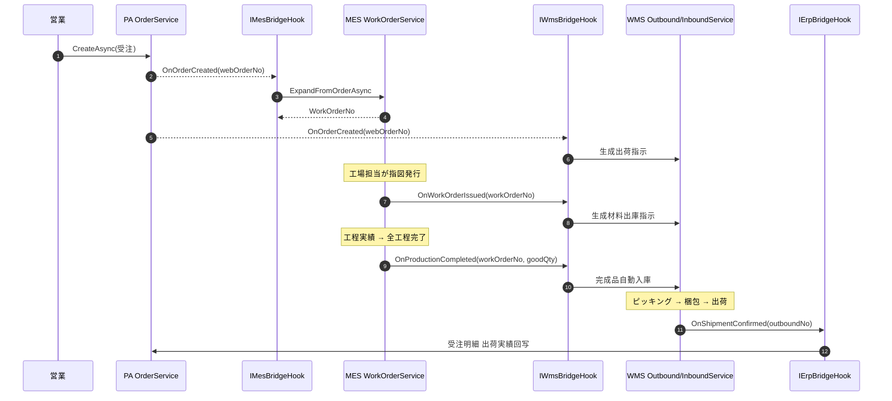
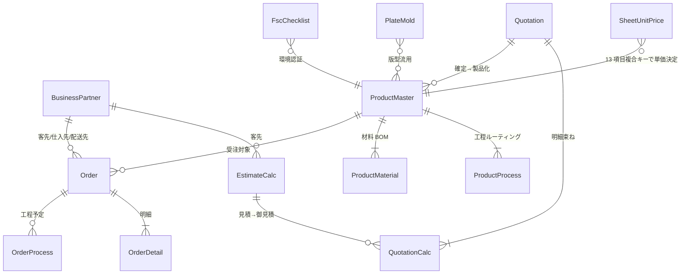
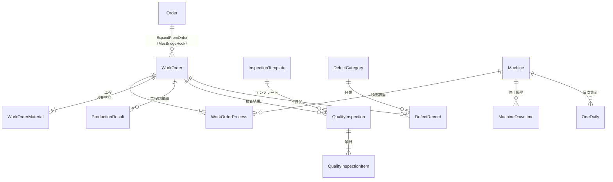
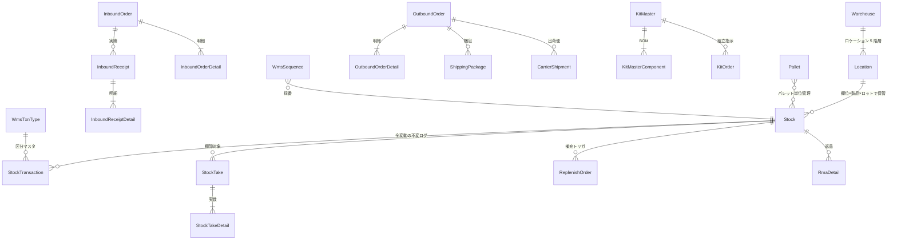

# CP6 项目结构总览（PROJECT STRUCTURE）

> **范围**：代码架构 + 业务流程 + 模块清单 + 数据模型 ER，四合一参考图。
> **状态**：截至 2026-06-03。代码盘点：4 个 .NET 项目 + 1 个 Vue3 前端、53 个 Controller、~70 个 Entity、~85 个前端 view、192/192 测试通过。
> **与既存文档的关系**：
> - `DEVELOPMENT-GUIDE.md` — 教程视角（怎么搭起来）。本文是参考视角（现状有什么、怎么连）。
> - `docs/business-flow-walkthrough.md` — Phase 1 时期的业务流（部分已过时，WMS Phase 2~4 当时标 "未实装"，本文反映闭环 Phase 1-4 完成后的现状）。
> - `docs/MSBBWM_Requirements.txt` / `docs/MES_Requirements.txt` — 需求规格底稿。

---

## 一、技术栈与目录布局

```
D:\CP6\
├── CP6.Entity/          # 实体层  — DomainModels(BaseBizEntity / Sys_ / Erp / Mes / Wms) + DTOs
├── CP6.Core/            # 核心层  — Services + BridgeHooks + EFDbContext(CP6Context) + Generic Repository
├── CP6.WebApi/          # API 层  — Controllers(根 / Mes/ / Wms/) + SignalR Hubs + Filters + Program.cs DI
├── CP6.Tests/           # 测试层  — xUnit + Moq（192 用例，覆盖 Service 关键路径）
├── cp6.web/             # 前端    — Vue 3 + TS + Element Plus + Pinia + vue-i18n + Vite + Playwright
├── docs/                # 文档    — 需求规格 + 业务手册 + i18n/menu 种子 SQL
├── k8s/ + docker-*.yml  # 部署    — Docker Compose 单机 / K8s 集群 / cloudflared 隧道
└── CP6.slnx             # .NET solution（4 个 csproj）
```

### 分层依赖（严格单向）

```
CP6.WebApi  →  CP6.Core  →  CP6.Entity
CP6.Tests   →  CP6.WebApi / CP6.Core
cp6.web     ─(HTTP + SignalR WebSocket)→  CP6.WebApi
```

### 关键技术选型

| 层 | 技术 | 用途 |
|---|---|---|
| 后端框架 | ASP.NET Core 10 | RESTful API |
| ORM | EF Core 10 + Dapper 2.1 | CRUD（EF）+ 复杂报表（Dapper） |
| 认证 | JWT Bearer | 无状态身份验证 |
| 实时 | SignalR | Dashboard 推送、WCS 任务通知 |
| 缓存 | IDistributedCache | Memory / Redis 双模式 |
| 消息 | RabbitMQ.Client 7.2 | 异步消息（保留接口，部分场景启用） |
| DB | SQL Server 2022 | 关系型存储 |
| 前端 | Vue 3.5 + TS + Element Plus 2.13 | 组件化 SPA |
| 国际化 | DB 驱动 `Sys_Langs` 表（ZhCN / ZhTW / En / Ja / Ko 五语） | 字典式 i18n |
| 部署 | Docker Compose + K8s 1.35 + cloudflared | cp6.uk 公网访问 |

---

## 二、代码架构

### 2.1 三大子系统



### 2.2 .NET 4 层职责

| 项目 | 角色 | 主要内容 |
|---|---|---|
| **CP6.Entity** | 数据模型 | `BaseBizEntity`（Id/Creator/CreateDate/Modifier/ModifyDate/IsDeleted）→ `Sys_*`（用户/角色/菜单/字典/语言/日志）/ ERP（BusinessPartner/EstimateCalc/Quotation/Product/Order/...）/ `Mes/`（WorkOrder/ProductionResult/QualityInspection/Machine/Oee/Defect/Inspection*）/ `Wms/`（37 entity，详见第五节）+ `DTOs/` 子目录 |
| **CP6.Core** | 业务逻辑 | `EFDbContext/CP6Context.cs`（全 DbSet 注册 + OnModelCreating 索引/唯一键）<br>`BaseProvider/`（`IRepository` + `RepositoryBase` 通用仓储；`IService` + `ServiceBase` 默认实现，子类按需 override）<br>`Services/`（按域分目录：根 = ERP，`Mes/` `Wms/`），每个域一对 `I{Domain}Service.cs` + `{Domain}Service.cs`<br>**BridgeHooks/**：`IErpBridgeHook`、`IMesBridgeHook`、`IWmsBridgeHook`（见 2.3） |
| **CP6.WebApi** | HTTP 入口 | `Controllers/` 根（ERP）+ `Controllers/Mes/`（8 个）+ `Controllers/Wms/`（28 个）<br>所有 Controller 用 `[Route("api/...")]`，返回统一 `{code, message, data}` 形状<br>`Hubs/`（SignalR）+ `Filters/`（OperLogFilter 全局记录请求）+ `Program.cs` 集中 DI 注册 + `appsettings*.json` 切配置 |
| **CP6.Tests** | 测试 | xUnit + Moq，覆盖 ERP/MES/WMS Service 关键路径（库存进出、采番、Bridge Hook 触发）192 用例 |

### 2.3 跨模块联动 —— 四个 Bridge Hook（核心闭环）

`Best-Effort + 冪等 + appsettings 可禁用 + IntegrationEvent 持久化` 是四个 Hook 的共同设计原则。

| 接口 | 触发点 | 目标动作 | 失败处理 |
|---|---|---|---|
| `IMesBridgeHook.OnOrderCreatedAsync` | ERP `OrderService.CreateAsync` 受注作成成功后 | MES `WorkOrderService.ExpandFromOrderAsync` 自动展开製造指図 | 不阻塞受注；既有指図 → Skipped(ME-MSG-005) |
| `IWmsBridgeHook.OnWorkOrderIssuedAsync` | MES `WorkOrderService.IssueAsync` 指図発行後 | WMS 自动生成材料出庫指示 | 不阻塞発行；既有 OutboundOrder → Skipped |
| `IWmsBridgeHook.OnOrderCreatedAsync` | ERP 受注作成成功後 | WMS 自动生成製品出荷指示 | 同上 |
| `IWmsBridgeHook.OnProductionCompletedAsync` | MES 全工程完了時 | WMS 完成品自动入庫 | 不阻塞工程完了 |
| `IErpBridgeHook.OnShipmentConfirmedAsync` | WMS `OutboundService.ShipAsync` 出荷確定後 | ERP 受注 出荷実績回写（明細累計数量 + 実出荷日） | 不阻塞出荷；非 Shipping 区分 / WebOrderNo 無 → Skipped |
| `IOrderCancelBridgeHook.OnOrderCancelledAsync` **(Phase 6)** | ERP `OrderService.CancelAsync` 受注取消時 | 関連 OutboundOrder 取消（RSV 自動解除）→ 関連 WorkOrder 取消（Status=9）の順で反向級联 | 二段確認（force=false で探査のみ）/ 半路状態は NeedsDecision で返す |

**禁用切换**：`appsettings.json` の `MesBridge:Enabled` / `WmsBridge:Enabled` / `ErpBridge:Enabled` / `OrderCancelBridge:Enabled = false` → DI 注入対応的 `NoOp*BridgeHook`、全 hook 回 `Skipped`。

#### Phase 6 持久化基盤（BridgeHookBase + IntegrationEvent + Retry Worker）

全 4 個 Bridge Hook は `BridgeHookBase` を継承し、各分岐の末尾で `T_IntegrationEvent` に履歴を残す：

- **Success 時**：1 行記入（TargetNo セット、NextRetryAt = null）
- **業務スキップ時（InvalidOperationException）**：1 行記入（Status=SKIPPED、再試行なし）
- **想定外失敗時**：1 行記入（Status=FAILED、NextRetryAt = now + 60s）

バックグラウンド `IntegrationEventRetryWorker`（`appsettings.IntegrationEvent` 段で設定）が 60s ごとに Failed 行を再試行 → `IIntegrationEventDispatcher` が `(SourceModule, TargetModule, HookName)` キーで元 hook を呼び直す。MaxAttempts (既定 5) 到達で Status=DEAD、`IDeadLetterNotifier` が SignalR `WmsHub` への push + `Sys_OperLog`（IsAlert=true）に同時書込みで運維告警。

これにより：
- 三个子系统独立可测
- 任一禁用不影响其他
- 跨模块联动可在配置侧关停做单模块演示
- **失敗の可観測性 + 自動回復**（一時的 DB/網絡障害は worker 経由で自動修復、永続的失敗は DLQ + 告警）

---

## 三、业务流程（端到端闭环）

### 3.1 主干流（受注 → 製造 → 出荷 → 回写）



### 3.2 数据流要点

- **采番统一**：所有业务编号经 `IWmsSequenceService.NextAsync(prefix)`（WMS）/ `IMesSequenceService`（MES）/ `IDocNumber`（ERP）生成，prefix → `WmsSequence/MesSequence/DocSequence` 表自增（同 prefix 串行锁）。
- **库存写入唯一入口**：`T_Stock` 严禁直接 `UPDATE`，必经 `IStockMovementService.ApplyAsync(WmsTxnType, ...)` / `MoveAsync(...)`，由 Service 同时插入 `T_StockTransaction`（不变ログ）。
- **i18n**：所有翻译走 DB 表 `Sys_Langs`（key + ZhCN/ZhTW/En/Ja/Ko 五列）。新模块通过 `docs/wms-*-i18n-seed.sql` 按既有 MERGE 模式 upsert，前端 `vue-i18n` 加载后端 `/api/lang` 输出。
- **菜单**：`Sys_Menu` 树形结构（MenuId int + ParentId），通过 `docs/wms-menu-seed.sql` 注入；前端 `LayoutView.vue` 渲染左侧导航。
- **审计日志**：`OperLogFilter` 全局拦截所有 Controller，记录 Method / Path / Body / StatusCode / ElapsedMs 到 `Sys_OperLog`。

---

## 四、模块功能清单

### 4.1 系统基础（PMS / Sys_）

| 模块 | Controller | 前端 View | 说明 |
|---|---|---|---|
| 认证 | `AuthController` | `LoginView` | JWT 登录，6h Token |
| 用户 | `UserController` | `pms/UserView` | CRUD + 角色绑定 |
| 角色 | `RoleController` | `pms/RoleView` | 角色 + 菜单关联 (`Sys_RoleMenu`) |
| 菜单 | `MenuController` | `pms/MenuView` / `PermissionView` | 树形菜单 + 权限点 |
| 多语言 | `LangController` | `pms/LangView` | 5 语种翻译 CRUD |
| 字典 | `DictController` | `pms/DictView` | DictType + DictData 两层 |
| 操作日志 | `OperLogController` | `pms/OperLogView` | 全请求审计回查 |

### 4.2 ERP / 販売管理（PA 系列）

| 模块 ID | 名称 | Controller | 前端 View（路由） |
|---|---|---|---|
| PA010 | 見積計算書 | `EstimateCalcController` | `/estimate-calc` `/estimate-calc-list` |
| PA030 | 御見積書 | `QuotationController` | `/quotation` `/quotation-list` |
| PA050 | 製品マスタ | `ProductController` | `/product` `/product-list` |
| PA070 | 受注 | `OrderController` | `/order` `/order-list` `/order-price-correction` |
| PA100 | FSC チェック | `FscChecklistController` | `/fsc-checklist` |
| PA110/120 | 取引先マスタ | `BusinessPartnerController` | `/business-partner` `/business-partner-list` |
| PA130 | シート単価マスタ | `SheetUnitPriceController` | `/sheet-unit-price` |
| PA140/150 | 版型・木型マスタ | `PlateMoldController` | `/plate-mold` `/plate-mold-list` |
| — | ダッシュボード | `DashboardController` | `/dashboard` |
| — | マスタ汎用 | `MasterDataController` | （多业务复用） |

### 4.3 MES / 製造執行（ME 系列）

| 模块 ID | 名称 | Controller | 前端 View |
|---|---|---|---|
| ME010 | 生産計画ボード | `Mes/PlanningBoardController` | `/mes/planning-board` |
| ME020/030 | 製造指図 | `Mes/WorkOrderController` | `/mes/work-order` `/mes/work-order-list` |
| ME040/050 | 製造実績 | `Mes/ProductionResultController` | `/mes/production-result` `/mes/production-result-list` |
| ME060/070 | 品質検査 | `Mes/QualityInspectionController` | `/mes/quality-inspection` `/mes/quality-inspection-list` |
| ME080 | 不良管理 | `Mes/DefectRecordController` | `/mes/defect` |
| ME090 | MES Dashboard | `Mes/MesDashboardController` | `/mes/dashboard` |
| Phase4 | 設備 / OEE | `Mes/MachineController` `Mes/OeeController` | `/mes/machine-list` `/mes/oee` `/mes/control-tower` |

### 4.4 WMS / 倉庫管理（MSBBWM 系列）

按需求规格 `docs/MSBBWM_Requirements.txt` 分核心 + 扩展 + 报表：

**核心（WM010~090）**

| ID | 名称 | Controller | 主要 View |
|---|---|---|---|
| WM010 | 倉庫 / Location | `Wms/WarehouseController` | `WarehouseListView` |
| WM020 | 在庫照会 | `Wms/StockController` | `StockQueryView` |
| WM030 | 入庫指示 | `Wms/InboundOrderController` | `InboundOrderView` `InboundOrderListView` |
| WM040 | 入庫実績 | `Wms/InboundReceiptController` | `InboundReceiptView` `ProductionInboundView` |
| WM050 | 出庫指示 | `Wms/OutboundOrderController` | `OutboundOrderView` `OutboundOrderListView` |
| WM060 | ピッキング | （OutboundOrder 内部） | `PickingWorkView` |
| WM070 | 梱包・出荷 | `Wms/ShippingController` `Wms/CarrierController` | `PackingShipView` `CarrierView` |
| WM080 | 棚卸 | `Wms/StockTakeController` | `StockTakeView` `StockTakeListView` |
| WM090 | 補充 | `Wms/ReplenishController` | `ReplenishView` |

**扩展（WM100~290）**

| ID | 名称 | Controller | View |
|---|---|---|---|
| WM100 | Kit/組立 | `Wms/KittingController` | `KitView` |
| WM110 | Pallet/Slotting | `Wms/PalletController` `Wms/SlottingController` | `PalletView` `SlottingView` |
| WM120 | QC 検査 | `Wms/QcInspectionController` | `QcInspectionView` |
| WM130 | Lot トレース | `Wms/LotTraceController` | `LotTraceView` |
| WM140 | 期限管理 | `Wms/ExpiryController` | `ExpiryView` |
| WM150 | サンプル在庫 | `Wms/SampleStockController` | `SampleStockView` |
| WM160 | Cross-Dock | `Wms/CrossDockController` | `CrossDockView` |
| WM170 | 残材管理 | `Wms/RemnantController` | `RemnantView` |
| WM180 | インクロット | `Wms/InkController` | `InkLotView` |
| WM190 | 原紙ロール | `Wms/PaperRollController` | `PaperRollView` |
| WM200 | 版型在庫 | `Wms/PlateMoldController` | `PlateMoldView` |

**業界連携 & 拡張（WM300~330）**

| ID | 名称 | Controller | View |
|---|---|---|---|
| WM300 | RF 手持移動 WMS | `Wms/MobileController` | `MobileTaskView` |
| WM310 | WCS 連携 | `Wms/WcsTaskController` | `WcsTaskView` |
| WM320 | IoT センサー | `Wms/IotMonitorController` | `IotMonitorView` |
| WM330 | VMI / RMA | `Wms/VmiController` `Wms/RmaController` | `VmiView` `RmaView` |

**Report & Dashboard**

| ID | 名称 | Controller | View |
|---|---|---|---|
| WM-RPT | レポートセンター | `Wms/ReportCenterController` | `ReportCenterView` |
| WM-DASH | WMS Dashboard | `Wms/WmsDashboardController` | `WmsDashboardView` |

---

## 五、数据模型 ER（核心部分）

### 5.1 全局基类

`BaseBizEntity` 提供所有业务 entity 的公共字段：

| 字段 | 类型 | 说明 |
|---|---|---|
| Id | Guid | 主键 |
| Creator / CreateDate | string / DateTime | 创建审计 |
| Modifier / ModifyDate | string? / DateTime? | 更新审计 |
| IsDeleted | bool | 软删除标记 |

例外：`Sys_Menu` 用 `int MenuId`（非 Guid）以支持树形 ParentId。

### 5.2 ERP / PA 主链



### 5.3 MES 主链



### 5.4 WMS 主链（库存核心）



**`T_Stock` 关键设计**：
- 业务唯一键：`(WarehouseCd, LocationCd, ProductCd, LotNo)` 四列。
- 三个数量字段：`PhysicalQty`（物理在库）/ `AllocatedQty`（引当中）/ `AvailableQty`（= Physical - Allocated，物化在 DB 同时 Service 校验一致）。
- 特殊标志：`ExpiryDate`（FEFO 引当）/ `RecallFlag`（リコール禁出）/ `OwnerType + OwnerCd`（VMI 客先在库）/ `PaperRollNo`（原紙連携）。

**`T_StockTransaction` —— 不变ログ**：所有 `T_Stock` 变化都在此表追加一行，永不更新。这是 Lot トレース / 在庫履歴照会 / 監査的依据。

### 5.5 跨子系统连接键

| 来源 | 字段 | 去向 | 意义 |
|---|---|---|---|
| ERP `Order.WebOrderNo` | string | MES `WorkOrder.WebOrderNo` | 受注 → 指図反向追跡 |
| ERP `Order.WebOrderNo` | string | WMS `OutboundOrder.WebOrderNo` | 出荷指示の発生元 |
| MES `WorkOrder.WorkOrderNo` | string | WMS `OutboundOrder` / `InboundReceipt` | 材料出庫 / 完成品入庫の発生元 |
| WMS `OutboundOrder.OutboundNo` | string | ERP `OrderDetail.ShippedQty` | 出荷実績回写（ErpBridgeHook） |

---

## 六、关键约定与不变式

> 这些是「不该改 / 不能直接改」的硬规则，新增模块时必须遵守。

1. **库存写入唯一入口** — `T_Stock` 严禁直接 `Add`/`Update`，必经 `IStockMovementService.ApplyAsync/MoveAsync`，由它同时写 `T_StockTransaction`。
2. **采番统一接口** — 业务编号经 `IWmsSequenceService.NextAsync(prefix)` / `IMesSequenceService` / `IDocNumber`，禁手工拼字符串。
3. **Controller 返回形状** — 所有 API 返回 `{code: int, message: string, data: T}`，前端 `axios` 拦截器统一解包。
4. **Bridge Hook 接入** — 跨模块联动只能通过 `I*BridgeHook` 接口，禁直接 `using` 对方 Service 命名空间。
5. **i18n 落 DB** — 新增字段/按钮的翻译走 `Sys_Langs` MERGE 种子 SQL，不要写在前端硬编码字符串里。
6. **菜单注册** — 新模块的路由必须同步 `Sys_Menu` 种子，否则左侧导航不出现；前端 router 用动态 import 按需加载。
7. **OperLogFilter 是全局过滤器** — 不要在 Controller 内重复记录日志。
8. **测试覆盖范围** — 新 Service 必须在 `CP6.Tests` 加用例（参考 `WmsTests/`，覆盖正常 + 异常 + 边界数量），CI 跑 `dotnet test` 全绿才合并。

---

## 七、入手指引（按角色）

| 你想… | 看这里 |
|---|---|
| 搭一遍 dev 环境 | `DEVELOPMENT-GUIDE.md` 一二三阶段 |
| 跑一次端到端 demo | `docs/business-flow-walkthrough.md` 四〜七节（注：WMS 部分需对照本文档 §三 更新） |
| 新增一个 WMS 子模块 | 本文档 §六 八条约定 + `docs/MSBBWM_Requirements.txt` 对应 WM 章节 |
| 排查 ERP↔MES↔WMS 联动问题 | 本文档 §2.3 三个 Hook + `appsettings*.json` 的 `*Bridge:Enabled` 配置 |
| 加翻译 / 加菜单 | `docs/wms-menu-seed.sql` `docs/wms-*-i18n-seed.sql` 既有 MERGE 模板 |
| 看 ER 全貌 | 本文档 §五 + `docs/MSBBWM_ER_Diagram.md` |
| 看 Phase 6-10 整体改进 | 本文档 §八 + `docs/PROJECT_IMPROVEMENT_PLAN.md` |

---

## 八、Phase 6-10 改进汇总（生产硬化）

> 截至 2026-06-06，CP6 在 Phase 1-5 闭环基础上完成了 5 期生产硬化迭代。**测试总数 192 → 282**（+90），代码新增 ~6000 行。

### 8.1 改进路线一览

| Phase | 范围 | 核心产物 | 测试增量 |
|---|---|---|---|
| **Phase 6** | 受注取消反向級联 + Bridge Hook 持久化基盤 | `IOrderCancelBridgeHook` / `BridgeHookBase` / `IntegrationEventRetryWorker` / `IDeadLetterNotifier` | +33 |
| **Phase 7** | QC 状态阻止出货 + QualityInspection 自动联动 | `Stock.QcStatus` + `IStockQcService` + Allocate 过滤 + QI NG 自动标记 | +13 |
| **Phase 8** | 受注済未出荷 Dashboard + CSV 导出 | `IUnshippedOrderService` + Dashboard widget + RFC 4180 CSV | +13 |
| **Phase 9** | 材料欠品反流（不抛异常 → 写表 + SignalR 告警） | `MaterialShortage` 表 + `IMaterialShortageService` + Outbound 改造 | +6 |
| **Phase 10a** | RMA → ERP CreditNote 自动回写 | `IErpBridgeHook.OnReturnConfirmedAsync` + `CreditNote` 实体 + `OrderDetail.ReturnedQty` | +4 |
| **Phase 10b** | Bridge Hook Health Monitor（24h 成功率 + DLQ + 手动补偿） | `IBridgeHealthService` + `BridgeHealthView.vue` + Compensate endpoint | +4 |

### 8.2 Phase 6 — 受注取消反向級联（核心架构升级）

**问题**：原闭环只覆盖正路径，客户取消订单后已展开的 WO/Outbound 不会反向解锁，造成库存幽灵引当。

**方案**：
- 加 `Order.OrderStatus` lifecycle string（CONFIRMED / IN_PRODUCTION / SHIPPED / CANCELLED / PARTIALLY_CANCELLED），与既有 mc転送 int Status 独立
- `IOrderService.CancelAsync(no, reason, force, user)` 状态机：Rejected / NeedsDecision / Cancelled / PartiallyCancelled
- `IOrderCancelBridgeHook` 两段模式：force=false 探查 / force=true 实施
- 实施顺序：先 OutboundOrder 取消（自动 UNRSV）→ 再 WorkOrder 取消 → 最后 Order 头取消
- 前端 `OrderCancelDialog.vue` 三步流：理由输入 → 探查结果 → 半路状态强制确认

**Bridge Hook 持久化基盤（4 个 hooks 共享）**：
- 新表 `T_IntegrationEvent`：Status (PENDING/SUCCESS/SKIPPED/FAILED/DEAD/COMPENSATED), Attempts, NextRetryAt, CorrelationId, PayloadJson
- `BridgeHookBase.PersistEventAsync` 在每个 hook 调用末尾写记录
- `IntegrationEventRetryWorker` BackgroundService 每 60s 扫 Failed → `IIntegrationEventDispatcher` 反射路由 → 重跑原 hook
- 失败 5 次自动转 DeadLetter → `IDeadLetterNotifier` 双通道告警（SignalR `WmsHub` + `Sys_OperLog.IsAlert=true`）

### 8.3 Phase 7 — QC 阻止出货

**问题**：QC NG 检查只起 `DefectRecord` 记录，但 NG 品仍可被 Allocate 出货。

**方案**：
- `Stock.QcStatus`（PENDING/PASSED/FAILED/HOLD，默认 PENDING）
- `OutboundService.AllocateAsync` 候选过滤：`s.QcStatus != FAILED && s.QcStatus != HOLD`
- `IStockQcService.SetStockQcStatusAsync(stockId, status, reason)` 手动维护
- `IStockQcService.MarkLinkedStockByWorkOrderAsync(woNo, status)` 按 WO 批量
- **自动联动**：`QualityInspectionService.CreateAsync` 末尾，OverallResult=2 (NG) → 自动调 MarkLinkedStockByWorkOrderAsync(FAILED)
- 前端 `StockQueryView.vue` 加「QC 状态」列 + 设置弹窗（4 个状态 radio + 理由）

### 8.4 Phase 8 — 受注済未出荷 Dashboard

**问题**：营业看不到「我的客户哪几单还没发」。

**方案**：
- `IUnshippedOrderService.SearchAsync` 查 `Order.ShipStatus < 9 AND OrderStatus NOT IN (SHIPPED, CANCELLED)`，join BusinessPartner + 聚合 WorkOrder.Status + OutboundOrder.Status
- Dashboard widget 列：受注号 / 客户 / 交期（超期红 tag）/ Status / 数量 进度 / MES summary / WMS summary
- `IUnshippedOrderService.ExportCsvAsync` RFC 4180 引号转义 + UTF-8 BOM
- **重要踩坑**：widget loadUnshipped() 不能放在 `loadData()` 里 —— 会和 `NewOperLog` SignalR 互推形成正反馈循环。独立 `onMounted` 触发 + 手动 refresh 按钮。

### 8.5 Phase 9 — 材料欠品反流

**问题**：MES 指図発行时 WMS 引当不足直接抛 `InsufficientStockException`，看不到结构化的「缺什么单」清单。

**方案**：
- 新表 `T_MaterialShortage`（WorkOrderNo / RelatedOutboundNo / ProductCd / RequiredQty / AvailableQty / Status: OPEN/RESOLVED/DISMISSED）
- `OutboundService.AllocateAsync` 当 `header.OutboundType == Material` 且引当不足 → **不抛**，改为写 `T_MaterialShortage` + SignalR `MaterialShortageDetected` 推送 + header.Status = PartialAllocated
- **关键边界**：`OutboundType == Shipping` 仍然抛异常（保持出荷的强一致语义不被破坏）
- `IMaterialShortageService` Resolve/Dismiss API 让运维手动关闭单

### 8.6 Phase 10a — RMA → ERP CreditNote 闭环

**问题**：RMA 在 WMS 端入库后，ERP 的应收账款不自动调整。

**方案**：
- `IErpBridgeHook` 加 `OnReturnConfirmedAsync(rmaNo, userName)` 方法
- `RmaService` 确認後 best-effort 调用 bridge
- 新表 `T_CreditNote`（Type: REFUND/EXCHANGE/SCRAP，含 RmaNo / WebOrderNo / Qty / Amount）
- `OrderDetail.ReturnedQty` 累计字段
- 通过 `RmaHeader.OriginalShippingNo → OutboundOrder.WebOrderNo` 解析关联受注
- 全程经 `BridgeHookBase.PersistEventAsync` 写 IntegrationEvent

### 8.7 Phase 10b — Bridge Hook Health Monitor

**问题**：Bridge Hook 失败有了 DLQ + 告警但缺集中视图。

**方案**：
- `IBridgeHealthService.GetMetricsAsync` 从 `T_IntegrationEvent` 聚合最近 24h：每个 Hook 的 Total / Success / Skipped / Failed / Dead / 成功率
- 当前队列深度（Status=Failed 且 NextRetryAt 已到的数量）
- 最近 10 条 DeadLetter 详情
- 前端 `/wms/bridge-health` 独立页面：3 KPI 卡片 + 每 Hook 一行表格 + DLQ 列表 + 「Mark Compensated」按钮（30s 自动刷新）

### 8.8 测试矩阵覆盖

```
Phase 6 (S2-S7)       33 个   测试 192 → 225
Phase 7 (Backend)     10 个   测试     → 235
Phase 8 (Backend)      9 个   测试     → 244
T1  Phase 7+8 E2E      2 个   测试     → 246  ← 注：T1 codex 实际报告 +4 包含 PartiallyCancelled 等扩展
T2  Auto QC link       3 个   测试     → 263
T3  CSV export         4 个   测试     → 267
T4  Bridge Health      4 个   测试     → 270
T5  Material shortage  6 个   测试     → 278
T6  RMA Credit Note    4 个   测试     → 282
```

**全部 dotnet test 通过，没有破坏既有 Phase 1-5 行为**。

### 8.9 部署 / 回滚要点

| 项 | 操作 |
|---|---|
| 应用 Phase 6 schema | `dotnet ef database update`（KOUSQLSERVER + docker cp6-db 两边） |
| 启用 Phase 6 Worker | `appsettings.json.IntegrationEvent.Enabled = true`（默认 true） |
| 灾难回滚 Bridge Hook | 各 `*Bridge:Enabled = false` → DI 注入对应 NoOp，全 hook 回 Skipped |
| 仅暂停 Phase 7 QC 拦截 | 手动把 Stock 行的 QcStatus 改回 PENDING（前端有按钮）|
| 关闭 Phase 9 自动写表 | OutboundService 改回原 throw 逻辑（git revert 单一 commit）|
| 监控 Bridge Hook 健康 | 访问 `/wms/bridge-health` 看 24h 成功率 + 队列深度 + DLQ |


---

*生成于 2026-06-03，via gstack `/document-generate` skill。*
