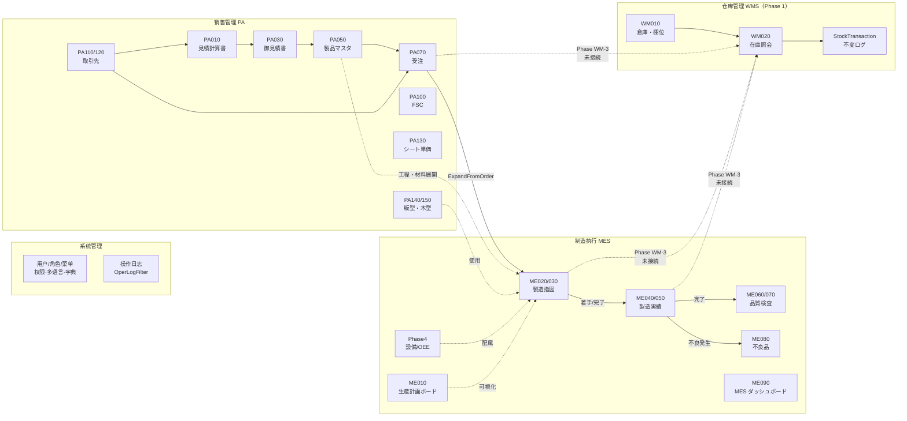
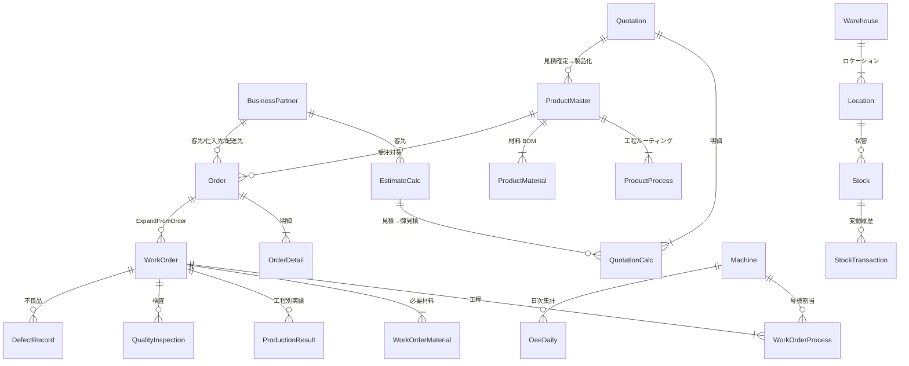

# CP6 业务流程总览 & 端到端演示

> **目的**：一张图看懂当前 CP6 里有什么模块、彼此怎么连接，以及一条"从无到有，从报价到入库"的完整流程怎么跑。
> **适用**：业务培训 / 新成员入职 / 自检本机部署是否完整。
> **状态**：截至 2026-05-22，包含 PA（销售）、MES（制造执行）、WMS Phase 1（仓库核心）+ Sys（基础）。

---

## 一、系统全景图



凡例：
- 実線（`-->`）：実装済の連携
- 点線（`-. ... .->`）：将来の接続予定
- 太字ノード：本ドキュメントで触れる主要モジュール

---

## 二、モジュール一覧

| ID | 名称 | 役割 | 主要 API ルート | 主要画面 |
|---|---|---|---|---|
| **Sys** | 系统管理 | 認証/権限/メニュー/多言語/字典/操作ログ | `/api/auth` `/api/user` `/api/role` `/api/menu` `/api/lang` `/api/dict` `/api/operlog` | `/login` `/user` `/role` `/menu` `/permission` `/lang` `/dict` `/operlog` |
| **PA110/120** | 取引先マスタ | 客先・仕入先・配送先などをフラグで識別する1テーブル | `/api/business-partner` | `/business-partner-list` `/business-partner` |
| **PA010** | 見積計算書 | 内部見積（採算試算）。8段階数量で連量・コストを計算 | `/api/estimate-calc` | `/estimate-calc-list` `/estimate-calc` |
| **PA030** | 御見積書 | 客先提出用。複数見積計算を束ねて1冊に | `/api/quotation` | `/quotation-list` `/quotation` |
| **PA050** | 製品マスタ | 確定製品。工程ルーティング・材料 BOM・ロット別単価 | `/api/product` | `/product-list` `/product` |
| **PA070** | 受注 | 客先確定オーダー。製品×納期×数量×単価 | `/api/order` | `/order-list` `/order` |
| **PA100** | FSC チェック | 環境認証エビデンス管理 | `/api/fsc` | `/fsc-checklist` |
| **PA130** | シート単価マスタ | 紙質×印刷×加工 の 13 項目複合キーで段ボール単価決定 | `/api/sheet-unit-price` | `/sheet-unit-price` |
| **PA140/150** | 版型・木型マスタ | 印版・トムソン木型の管理。受注時に流用 | `/api/plate-mold` | `/plate-mold-list` `/plate-mold` |
| **ME010** | 生産計画ボード | ガントチャート。受注済指図を時間軸で可視化 | `/api/mes/planning-board` | `/mes/planning-board` |
| **ME020/030** | 製造指図 | 受注から自動展開 or 手動作成。工程×材料 | `/api/mes/work-orders` | `/mes/work-order` `/mes/work-order-list` |
| **ME040/050** | 製造実績 | 各工程の開始/完了/良品数/不良数 | `/api/mes/production-results` | `/mes/production-result` `/mes/production-result-list` |
| **ME060/070** | 品質検査 | テンプレート連動の項目別検査・合否判定 | `/api/mes/quality-inspection` | `/mes/quality-inspection` `/mes/quality-inspection-list` |
| **ME080** | 不良品管理 | 不良分類・是正処置・ステータス追跡 | `/api/mes/defect` | `/mes/defect` |
| **ME090** | MES ダッシュボード | KPI・進捗・遅延アラート（SignalR push） | `/api/mes/dashboard` | `/mes/dashboard` |
| **Phase4** | 設備/OEE/Control Tower | 設備稼働可視化・OEE 日次集計・現場大屏 | `/api/mes/machines` `/api/mes/oee` | `/mes/machine-list` `/mes/oee` `/mes/control-tower` |
| **WM010** | 倉庫・ロケーション | 5 段階層（ゾーン→ビン）の棚位ツリー | `/api/wms/warehouse` | `/wms/warehouse` |
| **WM020** | 在庫照会 | 在庫実況・トランザクション履歴・棚移動 | `/api/wms/stock` | `/wms/stock` |
| **WM030~480** | （Phase 2~14） | 入出庫/出荷/棚卸/拡張/業界特化/連携 | 未実装 | 未実装 |

---

## 三、エンティティ関係（重要部分）



---

## 四、エンドツーエンド ゴールデンパス（完整走通）

下面是一条假想的「**新規客先がパッケージを発注 → 工場で製造 → 在庫として上架**」的完整流程。前提是已经按 `start-wms-phase1.bat` 起好系统、用 `admin / 123456` 登录。

### Step 0：マスタ確認（30 秒）

侧边栏 → **系统管理** → 检查：
- **多言語管理** ：右上语言切换器测试 5 国语言
- **菜单管理** ：能看到 4 大块（系统/販売/MES/WMS）

> 此步骤无 API 调用、纯界面验证。

---

### Step 1：取引先登録 — 客先「ABC 株式会社」

侧边栏 → **販売管理 → 取引先マスタ 登録**（`/business-partner`）

- 取引先CD：`C0001`
- 取引先名：`ABC 株式会社`
- フラグ勾选：`客先` / `売掛` / `納品先`
- 担当営業：任意の担当者CD
- 保存

**API**：`POST /api/business-partner`

---

### Step 2：見積計算書 — 内部試算

侧边栏 → **販売管理 → 見積計算書 登録**（`/estimate-calc`）

第 1 ページ（基本情報）：
- 客先CD：`C0001`（前ステップで作成）
- 客先品名：`スマホ用ギフトボックス`
- 発注数量：`10000`
- 受注区分：`01 通常`
- 製品分類大/中：`A` / `A01`
- 段組成：`A`
- 表 K 紙：`K280`、裏 K 紙：`K210`、中芯：`SK`

第 2 ページ（工程）：
- 工程を 2~3 行追加（例：印刷 → トムソン → 貼合）

第 3 ページ（結果）：
- 自動計算された原価/単価を確認
- 保存（採番例：`QC20260522-0001`）

**API**：`POST /api/estimate-calc`

---

### Step 3：御見積書 — 客先提出版

侧边栏 → **販売管理 → 御見積書 登録**（`/quotation`）

- 御見積NO：自動採番
- 客先：`C0001`
- 関連見積計算：`QC20260522-0001` を選択（複数選択可）
- 印字明細を確認（自動展開される）
- 保存（採番例：`QT20260522-0001`）

**API**：`POST /api/quotation`

---

### Step 4：製品マスタ — 客先確定後の製品化

侧边栏 → **販売管理 → 製品マスタ 登録**（`/product`）

- 製品CD：`P0001`
- 製品名：`スマホ用ギフトボックス`
- 客先：`C0001`
- 関連御見積：`QT20260522-0001`
- 工程ルーティング → 御見積から自動コピー可
- 材料 BOM → 同上
- ステータス → `登録済`
- 保存

**API**：`POST /api/product`

---

### Step 5：受注 — 客先発注

侧边栏 → **販売管理 → 受注入力**（`/order`）

- Web 受注NO：自動採番
- 客先：`C0001`
- 受注日：今日
- 明細追加：
  - 製品CD：`P0001`
  - 数量：`10000`
  - 客先納期：2 週間後
- 単価訂正画面（`/order-price-correction`）で必要なら単価微調整
- ステータス → `確定` で保存（採番例：`O20260522-0001`）

**API**：`POST /api/order` → `POST /api/order/{no}/confirm`

> 🔗 **Phase WM-3.5 自動 hook**：受注作成成功時に自動で WMS 出荷指示を生成する。
> backend.log に `[WMS-Bridge] 受注 O20260522-0001 → 出荷指示 OUT... 自動生成` が出力される。
> 失敗しても受注作成自体は成功（best-effort）。`appsettings.json` の `WmsBridge.Enabled=false` で無効化可。

---

### Step 6：製造指図展開 — PA070 → ME020

侧边栏 → **製造執行(MES) → 製造指図 入力**（`/mes/work-order`）

- 第 1 ページ：手配NO に `O20260522-0001` を指定 → 「展開」ボタン
- システムが自動で：
  - 受注の製品・数量・納期を読込
  - 製品マスタの工程ルーティング・材料BOM を展開
- 第 2 ページ：工程一覧確認・計画開始日/完了日を設定
- 第 3 ページ：材料一覧確認 → 「指図発行」
- 採番例：`WO20260522-0001`

**API**：`POST /api/mes/work-orders/expand-from-order` / `POST /api/mes/work-orders/{no}/issue`

> 🔗 **Phase WM-3.5 自動 hook**：指図発行（IssueAsync、status→2）成功時に自動で WMS 材料出庫指示を生成する。
> backend.log に `[WMS-Bridge] WO WO20260522-0001 → 材料出庫指示 OUT... 自動生成` が出力される。
> Step 13~15 の "自動展開ボタン" は手動代替手段として残しており、hook 失敗時のリカバリにも使える。

> **裏で動くこと**：PA050 の `ProductProcess` × N、`ProductMaterial` × N が
> ME020 の `WorkOrderProcess` × N、`WorkOrderMaterial` × N にコピーされる。

---

### Step 7：生産計画ボードで可視化（任意）

侧边栏 → **製造執行 → 生産計画ボード**（`/mes/planning-board`）

- ガントチャート上で `WO20260522-0001` のバーが表示される
- ドラッグして計画開始日を 1 日後ろにずらせる（ステータス=0/1 のみ）

**API**：`GET /api/mes/planning-board` / `PUT .../reschedule`

---

### Step 8：製造実績 — 工程別の開始・完了

侧边栏 → **製造執行 → 製造実績 入力**（`/mes/production-result`）

- 指図NO：`WO20260522-0001`
- 工程ごとに：
  - 「開始」ボタン → 実績開始時刻が記録
  - 良品数・不良数を入力
  - 「完了」ボタン → 工程ステータス=2（完了）
- 全工程完了 → 指図ステータス自動で `4 完了`

**API**：`POST /api/mes/production-results`

> **裏で動くこと**：全工程 `Status=2` を検知すると、`WorkOrder.Status` を `3:着手中` → `4:完了` に自動遷移。

---

### Step 9：品質検査 — 合否判定

侧边栏 → **製造執行 → 品質検査 入力**（`/mes/quality-inspection`）

- 指図NO：`WO20260522-0001`
- 検査テンプレート選択（事前に登録された項目セット）
- 各項目に実測値 + 合否を入力
- 総合判定：`合格` → 保存

**API**：`POST /api/mes/quality-inspection`

> 不合格の場合は **ME080 不良品管理** で自動起票され、是正処置を追跡する。

---

### Step 10：WMS 倉庫マスタ準備（Phase 1）

侧边栏 → **倉庫管理(WMS) → 倉庫マスタ**（`/wms/warehouse`）

「新規」ボタン → 倉庫を 2 件登録：

| 倉庫CD | 倉庫名 | 区分 | マイナス許可 |
|---|---|---|---|
| `W01` | 完成品倉庫 | 3 完成品 | OFF |
| `W02` | 不良品倉庫 | 4 不良品 | OFF |

**API**：`POST /api/wms/warehouse`

ロケーション追加（API か SSMS で直接 INSERT、現状画面が無いため）：

```bash
curl -X POST http://localhost:5177/api/wms/warehouse/location \
  -H "Authorization: Bearer <token>" \
  -H "Content-Type: application/json" \
  -d '{
    "locationCd":"W01-A-01",
    "warehouseCd":"W01",
    "locationLevel":5,
    "locationName":"A 通路 1 番棚",
    "isPickable":true,
    "isBlocked":false,
    "capacityQty":0
  }'
```

---

### Step 11：在庫の直接登録（PA/MES とは未接続）

> **重要**：Phase 1 ではまだ「指図完了 → 自動入庫」の連動がないため、
> 完成品 1万個を **直接 IN トランザクションで上架** する手動運用となる。
> Phase WM-3 で自動連動を実装する。

侧边栏 → **倉庫管理(WMS) → 在庫照会**（`/wms/stock`）→ 履歴を見るための画面のみ。

実際の IN は API で：

```bash
curl -X POST http://localhost:5177/api/wms/stock/apply \
  -H "Authorization: Bearer <token>" \
  -H "Content-Type: application/json" \
  -d '{
    "txnType":"IN",
    "warehouseCd":"W01",
    "locationCd":"W01-A-01",
    "productCd":"P0001",
    "lotNo":"LOT-20260522-001",
    "qty":10000,
    "unitCd":"EA",
    "relatedNo":"WO20260522-0001",
    "relatedType":"PRODUCTION",
    "remark":"指図 WO20260522-0001 完了入庫"
  }'
```

レスポンス例：
```json
{ "code":0, "message":"WM-MSG-071", "data":{ "txnNo":"TXN20260522-00001" } }
```

---

### Step 12：在庫確認

侧边栏 → **倉庫管理 → 在庫照会**

- 検索：製品CD `P0001`
- 1 行表示：物理在庫 `10,000` / 引当中 `0` / 利用可能 `10,000`
- 「履歴」ボタン → `TXN20260522-00001 / IN / +10000 / RelatedNo=WO20260522-0001` が見える

**API**：`GET /api/wms/stock?productCd=P0001` / `GET /api/wms/stock/{stockId}/history`

---

### Step 13：受注 → 出荷指示 自動展開（Phase WM-3）

侧栏 → **倉庫管理 → 出庫指示 一覧**（`/wms/outbound-order-list`）→ 「自動展開」ボタン

- 「受注NO」欄に `O20260522-0001` を入力 → 「展開」
- 自動で OutboundType=2（出荷）の指示が作られる：明細＝受注の製品・数量・単価

**API**：`POST /api/wms/outbound-order/from-order/O20260522-0001`

### Step 14：引当（FIFO + 期限優先）

開いた出庫指示画面で：
- 「確定」 → status 0→1
- 「引当実行」 → FIFO + 期限優先で Stock からロット・ロケーション自動割当
  - 明細に LotNo/LocationCd が埋まり、引当数が必要数と一致 → status 2 引当済
  - 在庫不足の場合は `WM-MSG-040` で失敗

**API**：`POST /api/wms/outbound-order/{outboundNo}/allocate`

### Step 15：出庫確定（OUT + 梱包）

- 「出庫確定」ボタン → ダイアログ
- 出荷区分（OutboundType=2）の場合：ケース数/重量/追跡番号などを入力
- 確定 → 各明細に OUT トランザクション発行 → Stock の PhysicalQty + AllocatedQty 同時減算
- 出荷区分の場合は `PKGYYYYMMDD-NNNN` 形式の梱包NOが自動採番される

**API**：`POST /api/wms/outbound-order/{outboundNo}/ship`

### Step 16：MES 製造指図 → 材料出庫 自動展開（並列パス）

同じ「自動展開」ダイアログで「製造指図NO」に `WO20260522-0001` を指定すると：
- OutboundType=1（材料出庫）の指示が自動生成
- 明細＝WorkOrderMaterial の MaterialCd / PlanQty 一覧
- 引当 → 出庫確定 で原材料が在庫から払い出される

**API**：`POST /api/wms/outbound-order/from-work-order/WO20260522-0001`

---

## 五、現時点の "接続済み" vs "未接続" 整理

| 接続 | 状態 | 実装位置 |
|---|---|---|
| BusinessPartner → EstimateCalc/Quotation/Order | ✅ 接続済 | 単純 FK 参照 |
| Quotation → ProductMaster | ✅ 接続済 | 工程・材料コピー |
| ProductMaster → Order | ✅ 接続済 | 受注時 BOM 参照 |
| **Order → WorkOrder（PA→ME）** | ✅ 接続済 | `WorkOrderService.ExpandFromOrderAsync` |
| WorkOrder → ProductionResult | ✅ 接続済 | 開始/完了 |
| ProductionResult → QualityInspection | ✅ 接続済 | 完了後検査 |
| ProductionResult → DefectRecord | ✅ 接続済 | 不良発生で起票 |
| PlateMold → WorkOrder | ✅ 参照 | 使用版型を WO に記録 |
| Machine → WorkOrderProcess | ✅ 接続済 | 号機割当 |
| Machine → OeeDaily | ✅ 接続済 | 日次バッチ集計 |
| **WorkOrder → WMS 材料出庫**（自動展開） | ✅ Phase WM-3 | `POST /api/wms/outbound-order/from-work-order/{wo}` |
| **Order → WMS 出荷指示**（自動展開） | ✅ Phase WM-3 | `POST /api/wms/outbound-order/from-order/{webOrderNo}` |
| **OutboundOrder 引当**（FIFO + 期限優先） | ✅ Phase WM-3 | `POST /api/wms/outbound-order/{no}/allocate` |
| **OutboundOrder 出庫確定**（OUT + 梱包） | ✅ Phase WM-3 | `POST /api/wms/outbound-order/{no}/ship` |
| **棚卸 計画→カウント→承認→ADJ** | ✅ Phase WM-4 | `POST /api/wms/stock-take/plan` ほか 6 endpoint |
| **WMS ダッシュボード（KPI/トレンド/アラート）** | ✅ Phase WM-4 | `GET /api/wms/dashboard/{kpi,trend,warehouse-value,alerts}` |
| **MES WO 発行 → 材料出庫 自動 hook** | ✅ Phase WM-3.5 | `WorkOrderService.IssueAsync` 末尾で `IWmsBridgeHook.OnWorkOrderIssued` 発火 |
| **PA 受注作成 → 出荷指示 自動 hook** | ✅ Phase WM-3.5 | `OrderService.CreateAsync` 末尾で `IWmsBridgeHook.OnOrderCreated` 発火 |
| **ProductionResult → WMS 製品入庫**（自動展開） | ❌ Phase WM-5+ | InboundReceipt の SourceType=PRODUCTION で手動入力可 |
| **QualityInspection 結果 → WMS 倉庫振分** | ❌ Phase WM-5+ | 未実装 |
| PA050 削除時 WMS 仕掛チェック | ❌ Phase WM-5+ | 未実装 |

---

## 六、よく使うテストデータ・アカウント

| 項目 | 値 |
|---|---|
| 管理者ログイン | `admin` / `123456` |
| ローカル DB | `localhost\KOUSQLSERVER` / `CP6DB` / Windows 認証 |
| Backend | <http://localhost:5177/swagger> |
| Frontend | <http://localhost:5173> |
| サンプル取引先CD | `C0001` 以降 |
| サンプル製品CD | `P0001` 以降 |
| サンプル倉庫CD | `W01`（完成品）/ `W02`（不良品） |

---

## 七、トラブル時の最短診断

| 症状 | 確認 |
|---|---|
| ログインできない | `backend.log` 末尾 / Swagger が開けるか |
| 言語切替が効かない | `Sys_Lang` の `nav.{id}` が 5 列揃っているか / 後端を再起動（キャッシュ 1h） |
| メニューが見えない | `Sys_RoleMenus` に該当 `RoleId=1, MenuId=400` が存在するか |
| WMS API が 404 | `start-wms-phase1.bat` で migration が走ったか / `T_Warehouse` テーブルが存在するか |
| 在庫が二重に増える | StockTransaction が同じ伝票NO で重複していないか確認、根本原因を調査 |

---

## 八、次のフェーズで埋める穴

| Phase | 状態 | やること |
|---|---|---|
| **WM-1** | ✅ 完了 | Stock/Location/Warehouse + 6 種類変動 |
| **WM-2** | ✅ 完了 | 入庫予定 + 入庫実績の画面化 |
| **WM-3** | ✅ 完了 | OutboundOrder（材料+出荷）+ FIFO引当 + 出庫確定 + 自動展開（WO/Order） |
| **WM-4** | ✅ 完了 | 棚卸（StockTake）4 段階フロー + WMS ダッシュボード（KPI/トレンド/アラート） |
| **WM-3.5** | ✅ 完了 | IWmsBridgeHook で MES WO 発行 → 材料出庫、PA 受注作成 → 出荷指示 を自動展開（best-effort、`appsettings.json: WmsBridge.Enabled` で切替可） |
| **WM-5（部分）** | ✅ 完了 | QC 入荷検品（PASS で自動入庫）+ RMA 5段階返品ワークフロー + FEFO 期限切迫一覧&一括廃棄 |
| **WM-5+（残）** | 未着手 | スロッティング / 補充 / クロスドック / キッティング / ロット追溯 |

---

— Last updated: 2026-05-22 — Phase WM-1 完了時点 —
